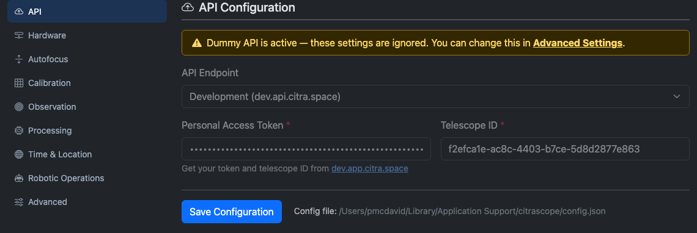
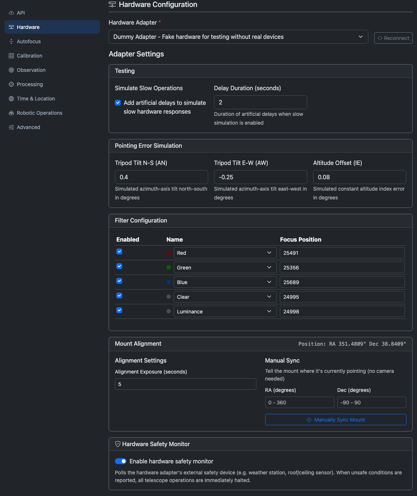
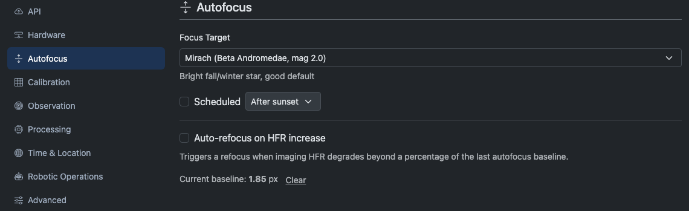
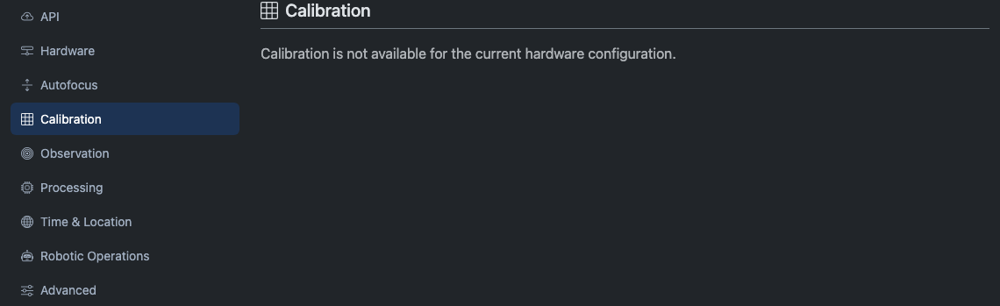
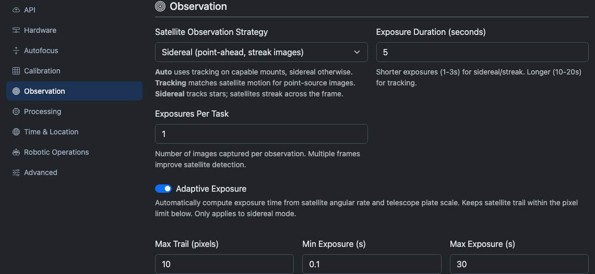
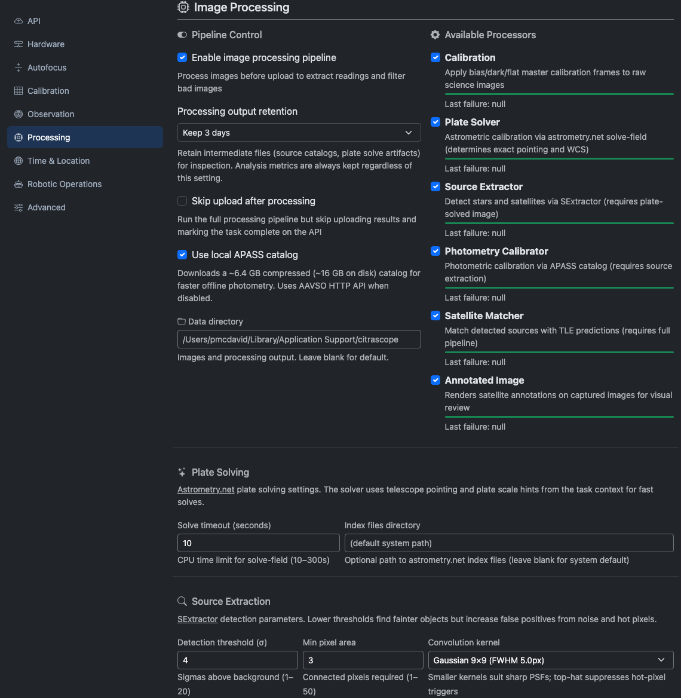
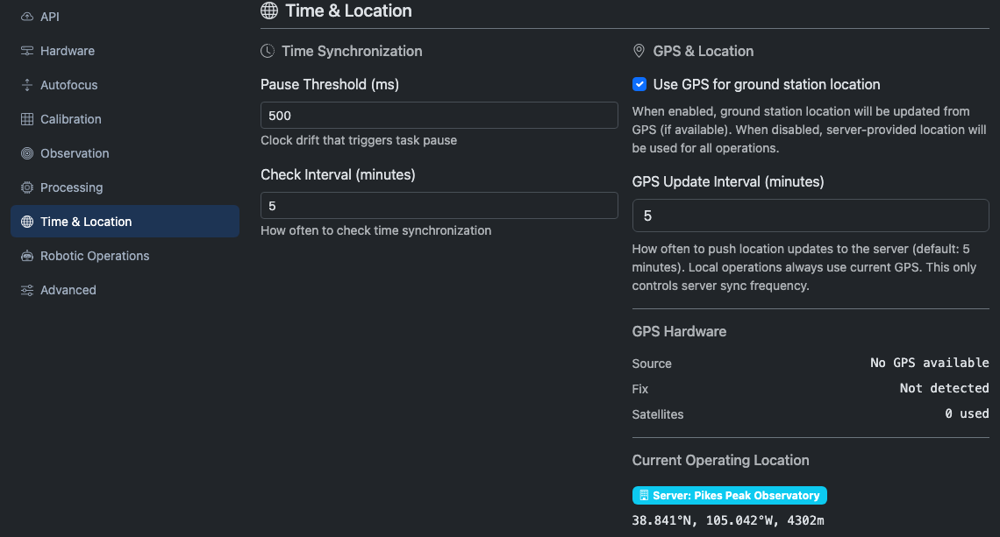
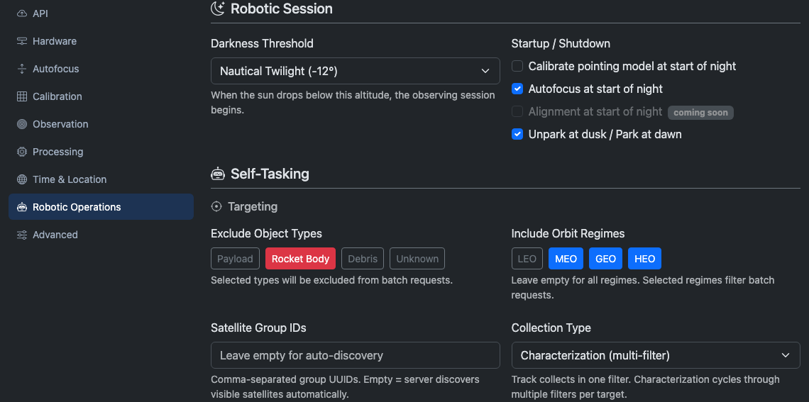
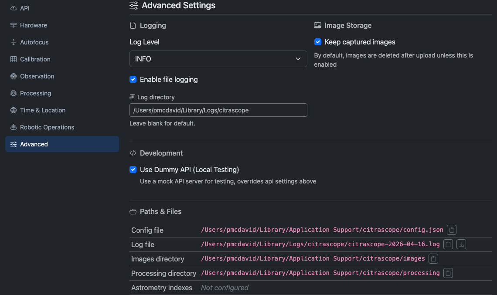

# Configuration
{: .no_toc }

The Configuration tab is where you connect CitraScope to the Citra Space platform, select and configure your hardware, tune observation and processing settings, and set up automated operations.

The page has a vertical side navigation on the left with nine sub-tabs. Your last-selected tab is remembered across sessions. Changes across all tabs are saved together with the **Save Configuration** button at the bottom.

  

    Table of contents
  

  {: .text-delta }
- TOC
{:toc}

---

## API

The API tab connects CitraScope to the Citra Space backend. All task polling, filter synchronization, and observation uploads go through this connection.

| Setting | Description |
|---------|-------------|
| **API Endpoint** | Which Citra API server to use. Choose **Production** for live operations or **Development** for testing. Select **Custom** to enter your own host, port, and SSL settings. |
| **Personal Access Token** | Your authentication token for the Citra API. Generate one from your account on the Citra Space web app. |
| **Telescope ID** | The UUID of your telescope as registered on Citra Space. Find it in your telescope's settings page on the web app. |

Both the token and telescope ID are required fields.

{: .note }
When [Dummy API mode](#advanced) is enabled, a warning banner appears on this tab and the fields are dimmed. The settings are still saved but will not be used until you disable Dummy API mode in the Advanced tab.

---

## Hardware

The Hardware tab selects which adapter controls your telescope equipment and exposes all adapter-specific settings.

### Adapter Selection

Choose your hardware adapter from the dropdown. Options include:

- **Direct Hardware** — CitraScope controls devices natively (ZWO cameras, Moravian cameras, ZWO EAF focuser, ZWO AM5 mount, USB cameras, Ximea cameras)
- **N.I.N.A. Advanced API** — Connects to a running N.I.N.A. instance over its HTTP/WebSocket interface
- **KStars / Ekos** — Connects to KStars via D-Bus
- **INDI** — Connects to an INDI server directly
- **Dummy Adapter** — Simulated hardware for testing without real devices

After selecting an adapter, click **Reconnect** to establish the connection. For the Direct adapter, a **Scan Hardware** button appears to detect connected USB devices.

### Adapter Settings

Each adapter exposes its own settings grouped into cards. These are generated dynamically based on the selected adapter. For example, the N.I.N.A. adapter shows connection host and port fields, while the Direct adapter shows device selection dropdowns for each hardware component.

If any system dependencies are missing for the selected adapter (like INDI or D-Bus libraries), a warning alert lists them with install commands.

### Filter Configuration

Once you save with an adapter selected, the filter configuration card appears. It shows each filter position reported by your hardware with:

| Column | Description |
|--------|-------------|
| **Enabled** | Whether this filter is available for observations. Disabled filters are skipped during characterization sequences. |
| **Name** | The filter's name. Choose from standard presets (Johnson-Cousins UBVRI, Sloan ugriz, Clear, Luminance) or enter a custom name. A colored dot shows the filter's display color. |
| **Focus Position** | The focuser step position for this filter. When switching filters, CitraScope moves the focuser to this position to compensate for filter-specific focus offsets. |

### Mount Alignment

This card appears when the adapter supports alignment or manual sync operations.

- **Alignment Exposure** — The exposure duration (in seconds) used when plate solving for pointing model calibration.
- **Manual Sync** — Enter a known RA and Dec (in degrees) and click **Manually Sync Mount** to tell the mount where it is pointing. Useful when the mount has no encoder feedback after power-on.

### Hardware Safety Monitor

When the adapter supports an external safety device (weather station, roof sensor, etc.), a toggle appears to enable or disable the hardware safety monitor. When enabled, CitraScope polls the safety device and halts all operations if unsafe conditions are reported.

---

## Autofocus

The Autofocus tab configures automatic focus management. It only appears when the selected hardware adapter supports autofocus.

### Focus Target

Choose where the telescope slews before running autofocus. Presets include bright stars chosen for different seasons (e.g., Mirach for fall/winter, Arcturus for spring). Select **Custom RA/Dec** to enter your own coordinates in degrees.

### Scheduled Autofocus

| Setting | Description |
|---------|-------------|
| **Scheduled** | Enable or disable automatic autofocus runs. |
| **Schedule Mode** | **Interval** runs autofocus every N minutes (30 min to 24 hours). **After sunset** runs autofocus once at a fixed offset after sunset. |

When a scheduled run is pending, the tab shows a countdown to the next autofocus.

### Auto-Refocus on HFR Increase

This feature monitors the Half-Flux Radius (HFR) of stars in captured images and triggers a refocus when image quality degrades.

| Setting | Description |
|---------|-------------|
| **Trigger at % increase** | How much HFR must rise above the baseline before triggering (10–200%). |
| **Sample window** | Number of recent frames to average when computing the current HFR (3–20). |
| **Current baseline** | The HFR value from the last successful autofocus. Click **Clear** to reset it, which forces a fresh autofocus on the next opportunity. |

---

## Calibration

The Calibration tab lets you capture and manage calibration frames (bias, dark, and flat masters). It only appears when the selected adapter supports direct camera control.

{: .note }
If the current adapter does not support direct camera control, this tab shows "Calibration is not available for the current hardware configuration."

When available, the Calibration tab shows:

- **Camera info** — Model, sensor ID, gain, binning, and temperature
- **Masters directory** — Where calibration masters are stored on disk
- **Readiness status** — Green checkmark when bias, dark, and flat masters all exist; otherwise a warning lists which are missing
- **Master frames table** — Lists existing masters with download and delete options

### Capturing Frames

Choose a frame type (bias, dark, or flat), set the exposure duration (for darks and flats), and select the filter (for flats). Click **Capture** to begin. A progress bar shows the current frame and overall batch progress.

### One-Click Suites

For convenience, the tab offers batch capture buttons:

- **Calibrate Bias & Dark** — Captures a set of bias frames followed by dark frames at the current exposure setting
- **Calibrate All Flats** — Captures flat frames for every enabled filter

You can configure how many frames to capture per type with the **Bias/Dark frame count** and **Flat frame count** fields.

---

## Observation

The Observation tab controls how CitraScope images satellites.

| Setting | Description |
|---------|-------------|
| **Satellite Observation Strategy** | How the telescope tracks during capture. **Auto** lets CitraScope decide per-task based on the satellite's apparent motion. **Tracking** matches the mount's motion to the satellite for point-source images. **Sidereal** holds the mount on the sky background, producing a satellite streak. |
| **Exposure Duration (seconds)** | How long each frame is exposed (0.01–300 seconds). Shorter exposures (1–3s) work well for sidereal/streak mode. Longer exposures (10–20s) work better for tracking mode. |
| **Exposures Per Task** | Number of frames captured per observation task (1–50). Multiple frames improve satellite detection reliability. |
| **Adaptive Exposure** | When enabled, CitraScope computes the exposure time automatically based on the satellite's angular rate and your telescope's plate scale, instead of using the fixed Exposure Duration above. The goal is to keep the satellite trail within the pixel limit you configure. Only applies to sidereal (streak) mode. |

When Adaptive Exposure is enabled, three additional settings appear:

| Setting | Description |
|---------|-------------|
| **Max Trail (pixels)** | The maximum satellite trail length in pixels. CitraScope shortens the exposure to stay within this limit for fast-moving targets. |
| **Min Exposure (s)** | The shortest exposure the adaptive algorithm will use, even for very fast satellites. |
| **Max Exposure (s)** | The longest exposure the adaptive algorithm will use, even for very slow targets. |

---

## Processing

The Processing tab controls the image processing pipeline that runs after each capture.

### Pipeline Control

| Setting | Description |
|---------|-------------|
| **Enable image processing pipeline** | Master switch for the entire pipeline. When off, captured images are uploaded raw. |
| **Keep processing output** | Retain intermediate files (source catalogs, plate solve artifacts) on disk for inspection and debugging. |
| **Skip upload after processing** | Run the full pipeline locally but do not upload results to the API. Useful for offline testing. |
| **Use local APASS catalog** | Use a locally downloaded copy of the APASS photometric catalog (~6.4 GB compressed, ~16 GB on disk) instead of querying the AAVSO HTTP API. Faster and works offline. |
| **Data directory** | Where images and processing output are stored. Leave blank for the platform default. |

### Available Processors

Each processor in the pipeline can be individually enabled or disabled:

| Processor | What it does |
|-----------|-------------|
| **Calibration** | Applies bias, dark, and flat master frames to raw science images. |
| **Plate Solver** | Determines exact pointing and WCS via astrometry.net's `solve-field`. |
| **Source Extractor** | Detects stars and satellites in the plate-solved image using SExtractor. |
| **Photometry Calibrator** | Cross-matches extracted sources against the APASS catalog and computes photometric zero-points. |
| **Satellite Matcher** | Matches detected sources to predicted satellite positions from TLE propagation. |
| **Annotated Image** | Renders an overlay JPEG with satellite annotations for visual review. |

Each processor shows a success/failure progress bar when statistics are available, along with the last failure reason if one occurred.

### Source Extraction

These settings control how SExtractor detects stars and satellites in each image. Lower thresholds find fainter objects but increase false positives from noise and hot pixels.

| Setting | Description |
|---------|-------------|
| **Detection threshold (σ)** | How many sigma above the background an object must be to be detected (1–20). Lower values find fainter streaks; higher values reduce noise detections. |
| **Min pixel area** | Minimum number of connected pixels required to count as a real detection (1–50). Increase this to suppress hot-pixel triggers. |
| **Convolution kernel** | The filter applied before detection. Smaller Gaussian kernels (3×3) suit sharp, undersampled PSFs. Larger kernels (5×5, 9×9) help with well-sampled or defocused stars. Top-hat kernels suppress single hot-pixel noise while preserving point sources. |

{: .note }
> The [Auto-Tune](Analysis.html#auto-tune-beta) tool in the Analysis tab can sweep parameter combinations automatically and suggest the best settings for your telescope.

### Plate Solving

| Setting | Description |
|---------|-------------|
| **Solve timeout (seconds)** | Maximum CPU time allowed per solve attempt (10–300 seconds). |
| **Index files directory** | Path to astrometry.net index files. Leave blank to use the system default. |

---

## Time & Location

The Time & Location tab configures clock synchronization and ground station positioning.

### Time Synchronization

Accurate timestamps are critical for satellite matching. CitraScope periodically checks the system clock against a reference and pauses operations if drift exceeds a threshold.

| Setting | Description |
|---------|-------------|
| **Pause Threshold (ms)** | Maximum allowed clock drift in milliseconds (1–10,000). If the measured offset exceeds this, task processing pauses until the clock is corrected. |
| **Check Interval (minutes)** | How often to check time synchronization (1–60 minutes). |

### GPS & Location

| Setting | Description |
|---------|-------------|
| **Use GPS for ground station location** | When enabled, CitraScope reads position from a connected GPS receiver (common on Raspberry Pi deployments). When disabled, the server-provided ground station location is used. |
| **GPS Update Interval (minutes)** | How often to push GPS location updates to the server (1–1,440 minutes). Local operations always use the current GPS fix; this controls how often the server record is synchronized. |

When GPS is enabled, the tab shows diagnostic information:

| Field | Description |
|-------|-------------|
| **Source** | The GPS device path or "No GPS available" |
| **Fix** | Current GPS fix coordinates or "Not detected" |
| **Satellites** | Number of GPS satellites in use |

### Current Operating Location

The bottom of the tab shows the active location source:

- **GPS** (green badge) — Using a live GPS fix
- **Server** (blue badge) — Using the ground station position registered on Citra Space
- **No location** (red badge) — No location available; satellite matching may be less accurate

When both GPS and a server-provided position are available, the tab shows both and warns if they diverge by more than 1 km.

---

## Robotic Operations

The Robotic Operations tab configures automated nightly sessions and self-tasking behavior.

### Robotic Session

These settings control what happens automatically at the start and end of each observing night.

| Setting | Description |
|---------|-------------|
| **Darkness Threshold** | The sun altitude that defines "dark enough to observe." Choose **Civil Twilight** (−6°), **Nautical Twilight** (−12°), or **Astronomical Twilight** (−18°). The observing session begins when the sun drops below this altitude and ends when it rises above it. |
| **Calibrate pointing model at start of night** | Plate-solve a known star to calibrate the mount's pointing model before the first task. |
| **Autofocus at start of night** | Run autofocus before the first observation of the session. |
| **Alignment at start of night** | (Coming soon) |
| **Unpark at dusk / Park at dawn** | Automatically unpark the mount when the session begins and park it when the session ends. |

### Self-Tasking

When the Citra API has no assigned tasks, CitraScope can generate its own observation targets. These settings control what it looks for.

| Setting | Description |
|---------|-------------|
| **Exclude Object Types** | Toggle which object categories to exclude from self-generated tasks: **Payload**, **Rocket Body**, **Debris**, **Unknown**. Selected types (highlighted) are excluded. |
| **Include Orbit Regimes** | Toggle which orbital regimes to include: **LEO**, **MEO**, **GEO**, **HEO**. Selected regimes (highlighted) are included. Leave all deselected for no filtering. |
| **Satellite Group IDs** | Comma-separated group UUIDs to restrict self-tasking to specific satellite groups. Leave empty for automatic target discovery. |
| **Collection Type** | **Track** captures in a single filter. **Characterization** cycles through multiple enabled filters per target for multi-band photometry. |

---

## Advanced

The Advanced tab holds logging, storage, and development settings.

### Logging

| Setting | Description |
|---------|-------------|
| **Log Level** | Verbosity of log output: **DEBUG**, **INFO**, **WARNING**, or **ERROR**. INFO is recommended for normal operations; DEBUG is useful for troubleshooting. |
| **Enable file logging** | Write log output to files on disk in addition to the WebSocket stream. |
| **Log directory** | Where log files are stored. Leave blank for the platform default (`~/Library/Logs/citrascope/` on macOS). |

### Image Storage

| Setting | Description |
|---------|-------------|
| **Keep captured images** | Retain raw FITS files after upload. By default, images are deleted after successful upload to save disk space. Enable this for post-processing or archival. |

### Development

| Setting | Description |
|---------|-------------|
| **Use Dummy API (Local Testing)** | Replace the live Citra API connection with a local mock server. Useful for testing CitraScope without an internet connection or API account. When enabled, the [API tab](#api) shows a warning and its settings are ignored. |

### Paths & Files

A read-only table at the bottom of the Advanced tab shows the file system paths CitraScope is using for this session. Each path has a clipboard button to copy it.

| Path | What it points to |
|------|--------------------|
| **Config file** | The `config.json` file where all settings are persisted |
| **Log file** | The current day's log file (shown only when file logging is enabled). A download button lets you save the log directly from the browser. |
| **Images directory** | Where captured FITS files are stored |
| **Processing directory** | Where intermediate pipeline files are written |
| **Astrometry indexes** | The directory containing astrometry.net index files (shown only when configured) |

{: .note }
> These paths are read-only and are shown for reference and troubleshooting. To change the log or data directories, use the Logging and Image Storage settings above.

---

## Saving Changes

All configuration tabs share a single **Save Configuration** button fixed at the bottom of the page. Pressing it saves every setting across all tabs at once. The button shows a spinner while saving.

The config file path is displayed next to the button for reference (e.g., `~/Library/Application Support/citrascope/config.json` on macOS).

Some changes take effect immediately (like log level), while others (like switching hardware adapters) may require a reconnect or restart.
