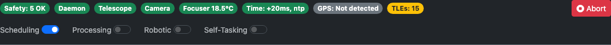
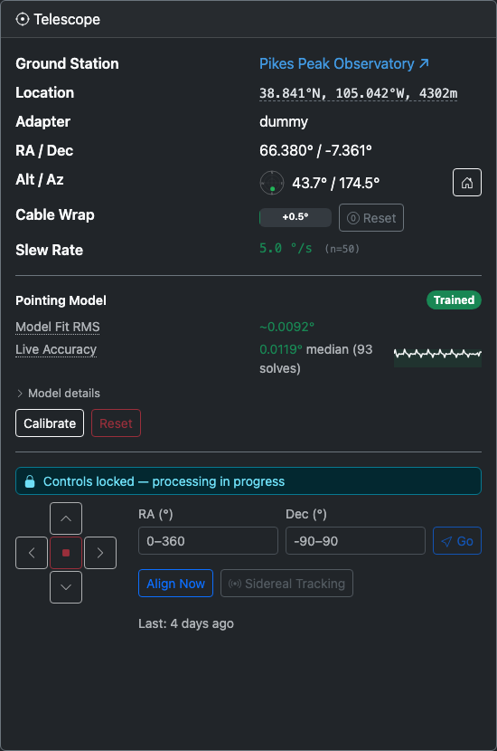
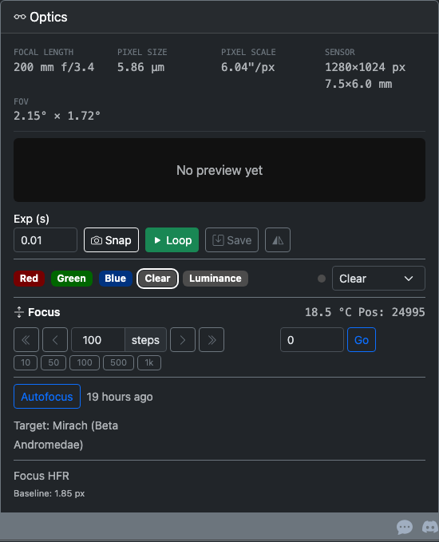
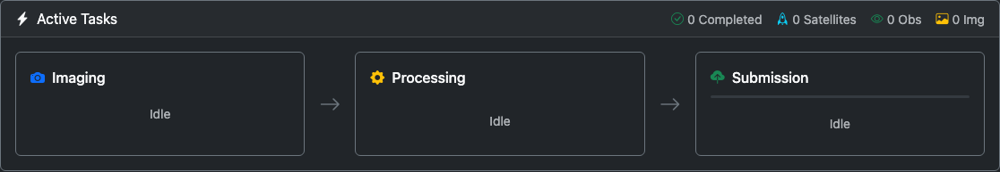
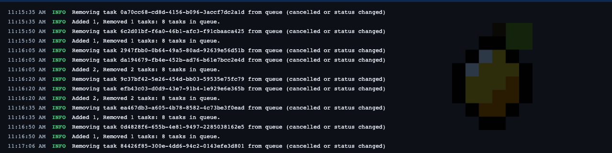

# Monitoring
{: .no_toc }

The Monitoring tab is the default view when you open the CitraScope dashboard. It shows the live state of your telescope, camera, task pipeline, and all operational controls in one place.

This page walks through every section of the Monitoring tab from top to bottom.

  

    Table of contents
  

  {: .text-delta }
- TOC
{:toc}

---

## Status Bar

The status bar runs across the top of every page (not just the Monitoring tab). It gives you an at-a-glance summary of system health through a row of colored badges, followed by a row of operational switches.

### Connection and Hardware Badges

Each badge is **green** when healthy, **yellow** for a warning state, **red** for a problem, or **gray** when unavailable. Hover over any badge for a detailed tooltip.

| Badge | What it shows |
|-------|---------------|
| **Safety** | Overall safety status. Aggregates all safety checks (operator stop, cable wrap, disk space, time health, hardware safety monitor). Shows the worst active condition. |
| **Daemon** | WebSocket connection between your browser and the CitraScope daemon. Green means you are receiving live updates. Yellow means the connection dropped and is reconnecting. Red means the daemon is unreachable. |
| **Telescope** | Whether the mount is connected. Tooltip shows the mount type and tracking state. |
| **Camera** | Whether the camera is connected. Shows the sensor temperature when available. Yellow if calibration frames are missing (bias, dark, or flat). |
| **Focuser** | Whether a focuser is connected. Shows temperature if the focuser reports it. Gray if no focuser is configured. |
| **Time** | System clock health. Shows the measured offset from a time reference. Green when within tolerance, red when drift is critical. |
| **GPS / Location** | Location source. Green with a strong GPS fix, yellow with a weak fix, gray when using a manually configured ground station position. |
| **TLEs** | Number of TLE element sets loaded in the satellite matching cache. Green when the cache has a healthy population (25,000+), yellow when low, red when empty. |

### Abort Button

The red **Abort** button at the right end of the badge row is an emergency stop. Pressing it immediately:

- Stops the mount
- Pauses all task processing
- Cancels any active imaging

Use this if something goes wrong and you need to halt all motion immediately. To resume operations afterward, re-enable the Processing switch and check that your mount is in a safe state.

### Mode Switches

Below the badges is a row of toggle switches that control how CitraScope operates:

| Switch | What it controls |
|--------|-----------------|
| **Scheduling** | When enabled, the Citra Space server assigns observation tasks to this telescope automatically. Turn this off to stop receiving new tasks. |
| **Processing** | When enabled, the daemon executes queued tasks (imaging, processing, uploading). Turn this off to pause all task execution while keeping your connection to the server active. |
| **Robotic** | Enables the robotic observing session lifecycle. When on, CitraScope automatically unparks at dusk, observes through the night, and parks at dawn. See [Robotic Session](#robotic-session) below. |
| **Self-Tasking** | When enabled, CitraScope automatically requests batches of observation tasks from the server when the queue runs low. Requires Scheduling and Robotic to also be enabled. |

{: .warning }
> If you enable Self-Tasking but leave Scheduling, Robotic, or Processing off, a yellow warning triangle appears next to the switches telling you which prerequisites are missing.

---

## Robotic Session

The Robotic Session card appears when the **Robotic** switch is enabled. It manages the nightly observing lifecycle automatically.

### Session States

The session cycles through four states, shown as a colored badge:

| State | Badge | What happens |
|-------|-------|-------------|
| **Daytime** | Gray | Telescope is parked. The card shows a countdown to the next dark window. |
| **Starting Up** | Blue | Sun has dropped below the twilight threshold. CitraScope unparks the mount and runs startup autofocus. |
| **Observing** | Green | The system is actively executing observation tasks. |
| **Shutting Down** | Yellow | Dawn is approaching. CitraScope finishes the current task, parks the mount, and prepares for daytime. |

### Session Info

The left side of the card shows:

- **Sun** — Current sun altitude in degrees
- **Threshold** — The twilight threshold that triggers the session (Civil at -6°, Nautical at -12°, or Astronomical at -18°, configured in settings)
- **Dark Window** — Start and end times for tonight's observing window, with total duration
- **Activity** — What the session is doing right now during startup or shutdown (e.g., "Unparking mount", "Running autofocus")

### Self-Tasking

When Self-Tasking is also enabled, the right side of the card shows:

- When the last batch of tasks was requested and how many were created
- When the next batch request is scheduled
- A summary of the targeting criteria: collection type (Track/Static), orbit regimes (LEO, MEO, GEO, etc.), and object types (Payload, Rocket Body, Debris)

These targeting criteria are configured in the Configuration tab under Robotic Operations.

---

## Telescope Card

The Telescope card shows your mount's current state and provides direct control for supported adapters.

### Status Fields

| Field | Description |
|-------|-------------|
| **Ground Station** | The name of your telescope's ground station in the Citra Space network. Links to the station page if a URL is configured. |
| **Location** | Operating latitude and longitude. Click to open Google Maps at your position. |
| **Adapter** | The active hardware adapter (Direct Hardware, N.I.N.A., KStars, or INDI). |
| **RA / Dec** | Current telescope pointing in degrees (Right Ascension / Declination). |
| **Alt / Az** | Current altitude and azimuth in degrees, with a small polar diagram. The dot shows where the telescope is pointing — center is zenith, the edge is the horizon, and north is at the top. |

### Cable Wrap

If your adapter tracks cable rotation, a progress bar shows the cumulative cable wrap in degrees. The bar fills toward the soft limit (where new tasks are paused) and the hard limit (where motion is aborted).

- **Unwind** — Reverses the mount rotation to unwind cables. Available when wrap exceeds 5°.
- **Reset** — Zeros the counter after you manually straighten cables.

### Altitude Limits

When the mount reports altitude limits, they are shown as the minimum (horizon) and maximum (overhead) degrees the mount will accept.

### Config Health

Telescope-related configuration checks appear here. Each check compares a value you have configured against what the hardware actually reports. If the observed value differs significantly from the configured value, a yellow warning shows the discrepancy as `configured → observed (+N%)`.

Currently tracked:

| Check | What it compares |
|-------|-----------------|
| **Slew Rate** | Configured maximum slew rate vs. the rolling mean of observed slew times. Shows the sample count `(n=N)` used to compute the average; warnings appear only once enough samples have been collected. |

More checks appear as the adapter collects data during a session.

### Pointing Model

For Direct Hardware adapters, the Pointing Model section shows:

- **Model state** — Untrained, Partial, Trained, or Degraded
- **Model Fit RMS** — The average residual error of the pointing model in degrees, color-coded green/yellow/red relative to your field of view
- **Live Accuracy** — Median pointing error measured from recent plate solves, with a sparkline chart showing the trend
- **Model Details** (expandable) — Leveling errors (N-S and E-W), model terms, and calibration point count

Controls:
- **Calibrate** — Runs an automated multi-point calibration sequence across the sky
- **Reset** — Clears all calibration data (requires confirmation)

During calibration, a progress bar shows the current step count.

### Mount Controls

For Direct Hardware adapters, additional mount controls appear at the bottom of the Telescope card:

- **Jog Pad** — A directional pad (N/S/E/W) for manual mount movement. Press and hold to move, release to stop. The center button is an emergency stop for all axes.
- **Go To** — Enter RA and Dec coordinates (in degrees) and press Go to slew the mount.
- **Align Now** — Triggers a plate-solve alignment to sync the mount model.
- **Sidereal Tracking** — Toggle sidereal tracking on or off.
- **Home** button (in the Alt/Az row) — Sends the mount to its home position.

{: .note }
> When the system is busy (e.g., during imaging or autofocus), mount controls are locked and a "System busy" indicator appears.

---

## Optics Card

The Optics card covers your camera, filter wheel, focuser, and autofocus — everything on the optical path.

### Config Health

A compact row at the top shows key optical parameters: focal length, pixel scale, field of view, and binning. These are compared against what the Citra Space server has configured for your telescope. If there is a mismatch (e.g., your actual focal length differs from the server config), a yellow warning banner appears with the configured vs. observed values.

### Preview Image

A live preview area shows the most recent image captured by the camera. Click the image to open it in a fullscreen modal.

For Direct Hardware adapters, camera controls appear below the preview:

| Control | Action |
|---------|--------|
| **Exp (s)** | Set the preview exposure time in seconds |
| **Snap** | Take a single preview exposure |
| **Loop** | Start continuous preview exposures (press again to stop) |
| **Save** | Capture a full FITS image using the current exposure |
| **Flip** | Horizontally flip the preview (useful for correcting a diagonal mirror) |

{: .note }
> Camera controls are disabled when the system is busy with imaging tasks or autofocus. A "System busy" lock icon appears.

### Filter Wheel

When filters are configured, a row of color-coded badges shows all enabled filters. The current filter has a white outline. For Direct Hardware adapters, a dropdown lets you switch filters manually.

### Focus Controls

When a focuser is connected, the Focus section shows the current position and temperature, with controls for manual adjustment:

- **Relative stepping** — Move the focuser in or out using coarse (double chevron, 10x step) or fine (single chevron, 1x step) buttons
- **Step size** — Adjustable via a number input or quick-select preset buttons (10, 50, 100, 500, 1k)
- **Absolute go-to** — Enter a target position and press Go
- **Abort** — Stop a move in progress (appears only while the focuser is moving)

### Autofocus

When your adapter supports autofocus, the Autofocus section shows:

- **Autofocus button** — Triggers a manual autofocus run. While running, changes to a Cancel button.
- **Last autofocus** — When the last run completed.
- **Per-filter results** — After a multi-filter autofocus, each filter's best focus position and HFR are listed in their filter color.
- **V-curve chart** — A plot of HFR (Half-Flux Radius) vs. focuser position for each filter, showing the characteristic V-shape that autofocus uses to find best focus.
- **Next in** — Countdown to the next scheduled autofocus run (if autofocus scheduling is enabled in settings).
- **Target** — Which target the autofocus routine will slew to (configured in settings as a preset star or custom coordinates).

### Focus HFR Health

Below autofocus, a Focus HFR readout tracks focus quality over time:

- **Current HFR** — The median half-flux radius from recent images, color-coded against the autofocus baseline (green = sharp, yellow = softening, red = needs refocus)
- **Sparkline** — A mini chart showing HFR trend over recent observations, color-coded per filter
- **Baseline** — The HFR established during the last autofocus, used as the reference point
- **Refocus threshold** — If HFR-triggered refocus is enabled, shows the percentage increase that will trigger an automatic refocus

---

## Dependency Warnings

If CitraScope detects missing system binaries at startup (for example, `solve-field` for plate solving or `source-extractor` for source extraction), a yellow alert banner appears near the top of the Monitoring tab. The banner lists each missing component along with the install command to resolve it. A clipboard button next to each install command lets you copy it in one click.

Once the dependency is installed and the daemon is restarted, the banner disappears.

---

## Safety Alerts

When any safety check enters a non-safe state, alert banners appear between the main cards and the task pipeline. Each alert shows a yellow (warning/hold) or red (emergency) banner:

| Alert | What it means |
|-------|--------------|
| **Operator Stop** | You (or another operator) activated an emergency stop. All motion is blocked. A "Clear Stop" button appears to resume. |
| **Cable Wrap** | Cumulative cable rotation has reached the soft limit (tasks paused) or hard limit (motion aborted). Shows the current degree count and whether an unwind is in progress. |
| **Disk Space** | Available disk space is low. At warning level, imaging continues but you should free space soon. At stop level, imaging is paused. Shows remaining free space. |
| **Time Health** | System clock drift is critical. Observations may be inaccurate because timestamps cannot be trusted. |
| **Hardware Safety** | An external safety monitor (e.g., a cloud sensor or weather station connected through N.I.N.A.) reports unsafe conditions. Telescope operations are suspended until conditions improve. |

---

## Active Tasks

The Active Tasks card shows the real-time task processing pipeline. Tasks flow through up to three stages from left to right, connected by arrows.

### Pipeline Header

The card header shows cumulative session counts:

- **Completed** — Total tasks that have finished all stages successfully
- **Satellites** — Number of satellite identifications made by the satellite matcher
- **Obs** — Observation data uploads to the Citra Space API
- **Img** — Image file uploads

### Pipeline Stages

| Stage | Icon | What happens |
|-------|------|-------------|
| **Imaging** | Camera | The telescope slews to the target, configures the camera, and captures exposures. Each task shows the target name, elapsed time, and a status message (e.g., "Exposing frame 3 of 5"). |
| **Processing** | Gear | Captured images pass through the processing pipeline: plate solving, source extraction, photometry, and satellite matching. A per-processor progress bar shows success/failure rates. Only visible when processors are enabled. |
| **Submission** | Cloud | Processed results are uploaded to the Citra Space API. A three-color progress bar shows observation uploads (green), image-only uploads (yellow), and failures (red). |

Each stage box shows:
- A **count badge** with the number of tasks currently in that stage
- A **progress bar** showing the success/failure ratio for that stage
- **Task entries** listing each task by name, elapsed time, and current status message

When a task encounters an error, the status message shows what went wrong and a retry countdown (e.g., "Upload failed, retrying in 45s...").

---

## Scheduled Tasks

The Scheduled Tasks card shows all observation tasks that have been assigned to your telescope, whether they came from the Citra Space server (via Scheduling) or were requested by Self-Tasking.

### Request Batch

The **Request Batch** button in the card header manually triggers a self-tasking batch request. This fetches a new set of observation tasks from the server immediately, without waiting for the automatic request interval. Useful when you want to fill the queue right away.

### Task Table

The table lists each scheduled task with:

| Column | Description |
|--------|-------------|
| **Target** | The name of the observation target |
| **Filter** | The assigned filter, shown as a color-coded badge matching the filter wheel |
| **Sky** | A miniature polar compass showing where the target sits in the sky. The center is zenith and the edge is the horizon, with North at the top. The dot is **green** when the target is well above your minimum elevation, **yellow** when it is within 10° of that limit, and **red** when it is below it. A dashed ring marks the configured minimum elevation. Hover for exact altitude, azimuth, trend, peak altitude, and estimated slew time. |
| **Countdown** | Time until the observation window opens (or closes, if the task is active) |
| **Window** | The start–end time range for the observation window (hidden on small screens) |
| **Actions** | A **Cancel** button (×) appears for pending tasks. Pressing it cancels the task on the Citra Space server and removes it from the queue immediately. The button is not shown for the currently active task. |

Active tasks are highlighted. Completed and cancelled tasks are removed on the next poll cycle.

---

## Log Panel

The Log Panel is a collapsible terminal overlay pinned to the bottom of every page. It streams real-time log output from the CitraScope daemon over the WebSocket connection.

### Collapsed View

When collapsed, the panel shows a single line — the most recent log message. This lets you keep an eye on activity without the panel taking up screen space.

### Expanded View

Click the log bar to expand it. The panel shows a scrollable list of log entries, each color-coded by severity:

| Level | Color |
|-------|-------|
| **DEBUG** | Gray |
| **INFO** | White |
| **WARNING** | Yellow |
| **ERROR** | Red |

The panel auto-scrolls to show the latest messages. If you scroll up to read older entries, auto-scroll pauses until you scroll back to the bottom.

### Controls

- **Download** — Save the current log buffer to a file
- **Fullscreen** — Expand the log panel to fill the entire viewport (press Escape or click the button again to return to normal)
