# Analysis
{: .no_toc }

The Analysis tab is a post-session performance dashboard. It reads the task history CitraSense records on disk and surfaces per-task metrics, timing breakdowns, lateness attribution, and tools for reprocessing and resubmitting observations.

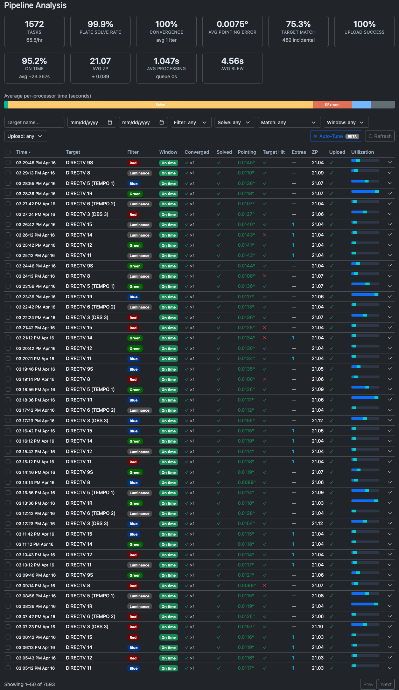

---

## Summary Cards

A row of metric cards at the top summarizes all tasks in the current history window. Cards show a dash when no data is available.

| Card | What it shows |
|------|--------------|
| **Tasks** | Total completed tasks and tasks-per-hour rate |
| **Plate Solve Rate** | Percentage of tasks where plate solving succeeded |
| **Convergence** | Percentage of tasks where the telescope converged on the target, plus average iteration count |
| **Avg Pointing Error** | Mean angular pointing error in degrees across all plate-solved tasks |
| **Target Match** | Percentage of tasks where the target satellite was detected, plus total incidental (non-target) satellite detections |
| **Upload Success** | Percentage of tasks that uploaded to Citra Space successfully |
| **On Time** | Percentage of tasks that started within their observation window, plus average start delay |
| **Avg ZP** | Mean photometric zero-point and standard deviation |
| **Avg Processing** | Average time for the full processing pipeline, plus average queue wait |
| **Avg Slew** | Average time to slew to a target |

---

## Processor Timing Bar

Below the summary cards, a horizontal stacked bar shows average processing time by pipeline stage. Each segment represents one processor (calibration, plate solver, source extractor, photometry, satellite matcher, annotated image). Hover a segment for the exact name and average time. Segments narrower than 5% are unlabeled to avoid clutter.

---

## Filters

A row of controls narrows the task list. All filters apply instantly.

| Filter | Options |
|--------|---------|
| **Target name** | Free-text search |
| **Date range** | From / To date pickers |
| **Filter** | Optical filter name; populated from the history |
| **Solve** | Solved / Not solved / Any |
| **Match** | Target matched / Target not matched / Has extra detections / No detections / Any |
| **Window** | On time / Missed / Any |
| **Upload** | Uploaded / Failed / Skipped / Any |

---

## Task List

Each completed task is a row in the table. Click any row to expand its [detail panel](#task-detail-panel). Check the checkbox on a row to select it for batch operations.

**Selecting tasks:**
- Click a checkbox to toggle one task.
- **Shift+click** to select a range between the last-clicked row and the current one.
- The header checkbox selects or deselects all tasks currently visible (it shows a dash when the selection is partial).

### Columns

| Column | Description |
|--------|-------------|
| **Time** | When the task completed. Sortable. |
| **Target** | Satellite or target name |
| **Filter** | Optical filter used, shown as a color-coded badge |
| **Window** | Whether the task started within its observation window. **On time** (green), **Late +Xs** (yellow), or **Missed** (red). Late tasks show a prefix: ⚑ means this task was the origin of the delay; ↙ means most of the delay was inherited from the previous task. Hover for the full breakdown. |
| **Converged** | ✓ / ✗ and iteration count (×N) |
| **Solved** | ✓ / ✗ for plate solve success |
| **Pointing** | Final pointing error in degrees, color-coded green/yellow/red |
| **Target Hit** | ✓ if the target satellite was detected and matched |
| **Extras** | Count of non-target satellites incidentally detected in the frame |
| **ZP** | Photometric zero-point |
| **Upload** | ✓ uploaded / ✗ failed / skip / … pending |
| **Utilization** | A miniature window bar showing how the observation window was spent (delay → slew → imaging → margin). |

---

## Task Detail Panel

Click any row to expand a two-column detail panel beneath it.

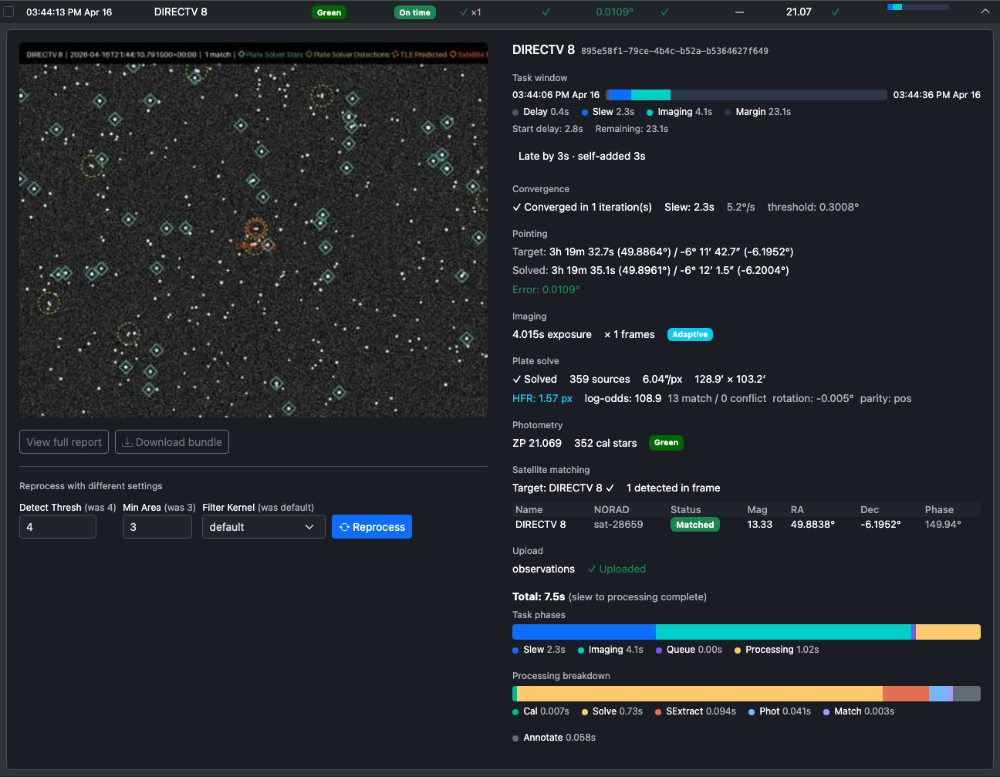

### Left column — image and actions

**Preview image** — The annotated image thumbnail for the task. Click it to open a fullscreen lightbox (click outside or press Escape to close).

**View full report** — Opens a standalone HTML report with full pipeline output for this task. Available only while processing artifacts are retained on disk.

**Download bundle** — Downloads a ZIP containing the raw FITS images, source catalog, and metadata JSON for this task. Useful for offline debugging. Available while artifacts are retained.

{: .note }
> Both buttons show an **Artifacts expired** badge instead when CitraSense has cleaned up the files. Retention duration is configured by the **Keep Processing Output** setting.

#### Reprocess panel

When artifacts are available, a reprocess panel appears below the action buttons. It lets you re-run the processing pipeline against this task's stored images with different SExtractor settings — without re-imaging.

| Field | Description |
|-------|-------------|
| **Detect Thresh** | Detection threshold in sigma. Shows the original value in parentheses; the input border turns yellow if you change it. |
| **Min Area** | Minimum connected pixel area for a detection. Same change indicator. |
| **Filter Kernel** | Convolution kernel applied before detection. Same change indicator. |

Press **Reprocess** to run. While running, a spinner replaces the button. When complete, the panel shows:

- **Settings diff** — old → new value for each parameter that changed (highlighted in yellow)
- **Results comparison** — Sources, ZP, Sats detected, and total processing time (original → new)
- **Per-processor badges** — each stage labeled green (success) or red (failure), with its time

After a successful reprocess, two more options appear:

- **View reprocessed report** — Opens the pipeline report for the reprocessed run
- **Upload Observation** (green button) — Submits the reprocessed result to the Citra Space API. Only appears when the reprocessed run detected satellites and the task is eligible for upload. Useful for recovering an observation where the original processing missed the target.

### Right column — metrics

**Task window bar** — An expanded view of the window utilization showing four segments:
- **Delay** (gray) — time before the task started
- **Slew** (blue) — mount slew to the target
- **Imaging** (cyan) — exposure time
- **Margin** (dark) — unused time remaining in the window

Below the bar, start delay and remaining time are shown as text. If the task overran its window, an ⚠ overran warning appears.

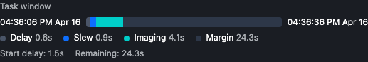

**Lateness attribution** — When a task started late, a box explains where the delay came from:
- *Late by Xs · inherited Ys from [previous task] · self-added Zs*
- If this task was the **slip origin** (i.e., it added the most delay), the box is highlighted in yellow and lists specific causes: slew overrun (estimated vs. actual slew time) and extra convergence iterations.
- The previous task name is a link — click it to jump to that task's detail panel.

**Convergence** — Whether the telescope converged, how many pointing iterations it took, total slew time, observed slew rate, and the convergence threshold used.

**Pointing** — Target RA/Dec requested, solved RA/Dec from the plate solve, and final pointing error.

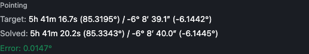

**Imaging** — Exposure duration, frame count, and an **Adaptive** badge if adaptive exposure was active for this task.

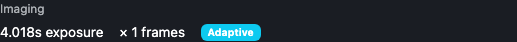

**Plate solve** — Solved/not, source count, pixel scale, field dimensions, a **Calibrated** badge if calibration frames were applied, HFR (half-flux radius), and solve quality metrics: log-odds score, match/conflict counts, field rotation, and parity.

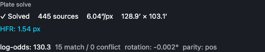

**Photometry** — Zero-point value, calibration star count, and the filter used.

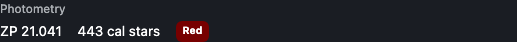

**Satellite matching** — Target name with ✓/✗ and its magnitude, total satellites detected in the frame, incidental match count, and a table of every satellite predicted to be in the field at the time of observation. The table shows name, NORAD ID, matched/predicted status, magnitude, RA, Dec, and phase angle.

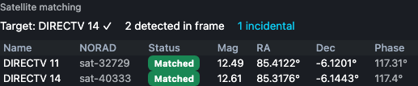

**Upload** — Upload type (photometric observation, image-only, or skipped), success/failure status, and skip reason when applicable.

**Task phases bar** — A stacked bar showing the full task duration broken into Slew / Imaging / Queue wait / Processing, with a labeled legend.

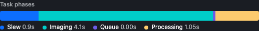

**Processing breakdown bar** — A second stacked bar zooming into the processing stage: Calibration / Plate solve / Source extraction / Photometry / Satellite matching / Annotated image.

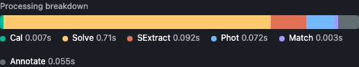

---

## Batch Reprocessing

When one or more tasks are selected, a batch action bar appears above the task list.

 It lets you reprocess multiple tasks at once with a specific set of SExtractor parameters.

Set **Detect Thresh**, **Min Area**, and **Filter** in the bar, then click **Reprocess Selected**. A progress counter (N/total) shows how many tasks have been processed. When complete, a summary shows how many succeeded and how many failed.

{: .note }
> Batch reprocessing does not automatically upload results. To upload a reprocessed result, open the task's [detail panel](#task-detail-panel) and use the **Upload Observation** button there.

---

## Auto-Tune (Beta)

The **Auto-Tune** button (top-right of the filter row) opens a panel that automatically finds better SExtractor settings for your telescope by sweeping parameter combinations across your stored processing artifacts.

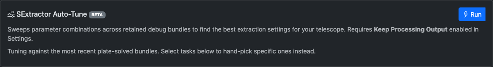

{: .warning }
> Auto-Tune requires **Keep Processing Output** to be enabled in Settings → Processing so that pipeline artifacts are retained for analysis.

### How it works

Auto-Tune evaluates a grid of detection threshold, minimum area, and convolution kernel combinations against your stored task bundles. Each combination is scored on:
- Satellite detection rate
- Calibration star count
- Detection purity
- False-positive risk

The top 10 configurations are ranked in a table with columns for each parameter, average source count, satellite detection rate, calibration stars, purity, and FP risk (green below 20%, yellow up to 50%, red above).

### Running Auto-Tune

1. Optionally check specific tasks in the list. If none are selected, Auto-Tune uses the most recent plate-solved bundles. For best results, select tasks where plate solving succeeded and the target was in the field.
2. Click **Auto-Tune**, then **Run**. A progress bar tracks evaluations (N/total).
3. Review the ranked results table. The top-ranked row is highlighted green.
4. Click **Apply Best** (or **Apply** on any other row) to push those settings directly to the Processing configuration.

Click **×** to cancel a running Auto-Tune.

---

## Pagination

When the history contains more than one page of tasks, **Prev** and **Next** buttons appear below the table with a count of the visible range (e.g., "Showing 1–25 of 783").
