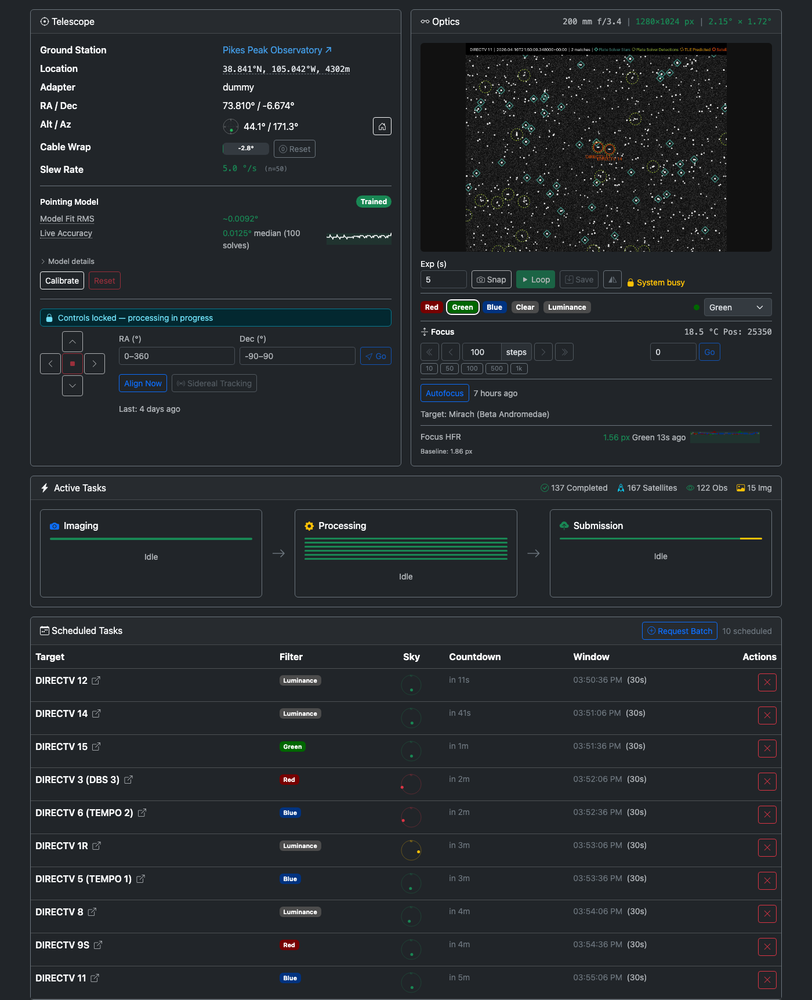

# Getting Started
{: .no_toc }

{: .note }
Looking for the Raspberry Pi image? See the [Raspberry Pi](RaspberryPi.html) page — flash an SD card and power on, no manual install needed.

## Quick start

Two commands get you to a running dashboard:

```bash
uv tool install citrasense
citrasense
```

Then open your browser to:

### [http://localhost:24872](http://localhost:24872)
{: .no_toc }

When the dashboard opens you'll see the Monitoring tab:



From here, [connect to the Citra Space API](Configuration.html#api) and pick a [hardware adapter](Adapters.html) — then you're imaging.

## Requirements

- Python **3.10 through 3.14**
- [uv](https://docs.astral.sh/uv/) (recommended) — handles Python versions, virtual environments, and dependencies in a single tool. `brew install uv` on macOS, `curl -LsSf https://astral.sh/uv/install.sh | sh` elsewhere.

## Hardware extras

Some devices need additional Python libraries (ZWO SDK, Moravian GxCCD, Ximea, etc.). Install every extra in one go, or only what you need:

```bash
uv tool install citrasense --with citrasense[all-hardware]
```

See [Direct Hardware](DirectHardware.html) for the per-device extras and the full list of supported cameras, mounts, filter wheels, and focusers.

## Alternatives

### Install with pip

If you'd rather manage your own Python environment:

```bash
pip install citrasense
```

### Use a different port

```bash
citrasense --web-port 8080
```

Useful when port 24872 is already taken, or when you're running multiple instances on one machine for testing.

## Next steps

- **[Hardware Adapters](Adapters.html)** — pick how CitraSense talks to your telescope. Direct Hardware is recommended on Linux/macOS/Pi; N.I.N.A. is the Windows path.
- **[Configuration](Configuration.html)** — API credentials, observation settings, processors, and autofocus.
- **[Operating CitraSense](Operating.html)** — a full walkthrough of a night's session, from alignment to batch imaging to robotic mode.
