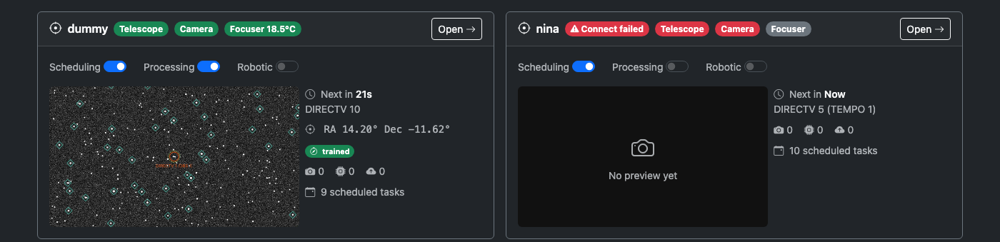
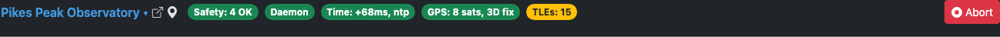
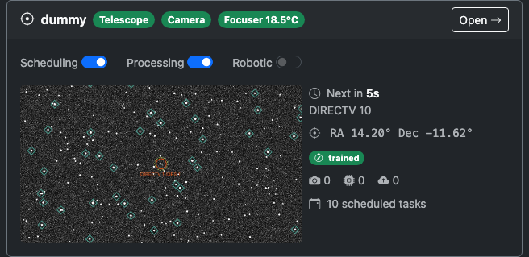
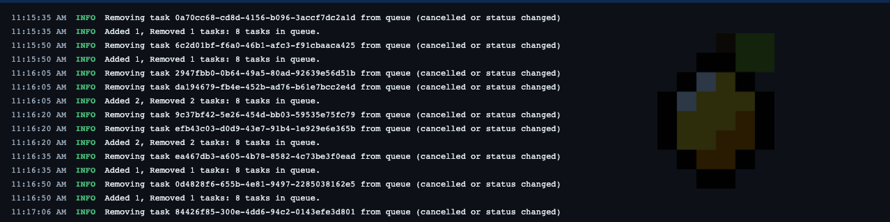

# Monitoring
{: .no_toc }

The Monitoring tab is the default view when you open the CitraSense dashboard. It shows the live state of every sensor attached to this ground station — telescopes, all-sky cameras, and staring cameras — alongside site-wide health badges and operational controls.

CitraSense supports multiple sensors per ground station. Each sensor gets its own hero card on the Monitoring tab and a dedicated detail page (`/sensors/<id>`) where its deep controls live. Click any card header — or its **Open** button — to jump to the detail page.

This page walks through the Monitoring tab from top to bottom.

---

## Status Bar

The status bar runs across the top of every page. It shows site-wide health: the active ground station, safety status, daemon connection, time and location health, the TLE cache, and the emergency abort button.

{: .note }
> The version string in the page header (top-left) is clickable — it opens a **Build Info** panel showing the running version, commit, build time, and install type, plus a **Check for updates now** button on Raspberry Pi images. See [Build info and on-demand updates](RaspberryPi.html#build-info-and-on-demand-updates).

### Ground Station Switcher

The leftmost element is the **active ground station** name. Click it to open a dropdown listing every other ground station registered to your Citra Space account.

- Pick another station to **switch sites** — CitraSense reassigns every sensor on this host to the target ground station, disconnects and reconnects hardware, and rebinds in place. The web UI stays up the whole time. A full-screen progress overlay shows the stages.
- **+ New ground station from current GPS** registers a brand-new station at your current GPS coordinates and switches to it.
- **View current location in Google Maps** opens a pin at the active position.

The compass icon next to the name opens the ground station page on citra.space if a URL is configured.

{: .note }
> Switching ground stations interrupts any imaging task in progress; in-flight processing and upload work is dropped and re-queued on the next poll.

### Site Health Badges

Each badge is **green** when healthy, **yellow** for a warning, **red** for a problem, or **gray** when unavailable. Hover for a detailed tooltip.

| Badge | What it shows |
|-------|---------------|
| **Safety** | Aggregate safety status across every site-level check (operator stop, disk space, time health, hardware safety) plus the worst-case per-sensor cable wrap. Shows `Safety: N OK` when everything is clear, `Safety: Hold` for a stop-level condition, or `Emergency` in red for emergency action. |
| **Daemon** | WebSocket connection between your browser and the CitraSense daemon. Green means you are receiving live updates. Yellow `Reconnecting Ns` means the connection dropped and is backing off. Yellow `Degraded` means the connection is up but no data has arrived for 5+ seconds. Red `Disconnected` means the daemon is unreachable. |
| **Time** | System clock health. Shows the measured offset against a reference. Green when OK, red when drift is critical. |
| **GPS / Location** | Location source. Green with a strong GPS fix, yellow with a weak fix, gray when falling back to the manually configured ground station position. |
| **TLEs** | Number of TLE element sets loaded in the satellite-matching cache. Green when the cache has a healthy population (25,000+), yellow when low, red when empty. |

Per-sensor hardware status (mount, camera, focuser, stream link, etc.) appears on each sensor's hero card below.

### Abort Button

The red **Abort** button at the right end of the badge row is an emergency stop. Pressing it immediately:

- Stops every mount on this host
- Pauses all task processing across every sensor
- Cancels any active imaging

Use this if something goes wrong and you need to halt motion everywhere at once. To resume operations afterward, re-enable each sensor's Processing switch and check that mounts are in a safe state.

---

## Safety Alerts

When any site-level safety check enters a non-safe state, an alert banner appears below the status bar. Per-sensor cable-wrap warnings appear as a pill inside the offending sensor's card.

| Alert | What it means |
|-------|--------------|
| **Operator Stop** | You (or another operator) activated an emergency stop. All motion is blocked. A **Clear Stop** button appears to resume. Always active — cannot be disabled. |
| **Disk Space** | Available disk space is low. At warning level, imaging continues but you should free space soon. At stop level, imaging is paused. Shows remaining free space. Thresholds and the check itself are configured on the [Safety](Configuration.html#safety) tab. |
| **Time Health** | System clock drift exceeds the [Pause Threshold](Configuration.html#time-synchronization). Observations may be inaccurate because timestamps cannot be trusted. Can be disabled on the [Safety](Configuration.html#safety) tab for rigs without reliable NTP. |
| **Hardware Safety** | An external safety monitor (e.g., a cloud sensor or weather station connected through N.I.N.A.) reports unsafe conditions. Telescope operations are suspended until conditions improve. |
| **Cable Wrap** | Cumulative azimuth rotation on a telescope's mount crossed its soft or hard limit. Appears as a pill on the offending sensor's hero card. Limits and the check itself are configured on the per-sensor [Safety](Configuration.html#safety-per-sensor) tab. |

---

## Per-Sensor Hero Cards

The body of the Monitoring tab is a grid of hero cards — one per sensor on this ground station. On wide screens they tile two per row; on phones and tablets they stack full-width. A single sensor sits in the left column with blank space to the right.

Each card has the same chrome but a modality-specific body:

- **Header**: sensor name (with a modality icon), an init-state badge if the sensor is not yet connected, modality-specific status pills, and an **Open** button that opens the dedicated sensor detail page.
- **Body**: a modality-specific summary. The modalities CitraSense ships today are Telescope, All-sky camera, and Staring camera.

Reconnect, configuration, and deep controls deliberately do **not** live on the Monitoring tab — open the sensor's detail page for those. This keeps a tap on the dashboard from triggering destructive actions by accident.

### Telescope Card

The telescope card shows the operational switches for that scope, a live preview, and a stats column.

**Operational switches** (per-telescope, not site-wide):

| Switch | What it controls |
|--------|-----------------|
| **Scheduling** | When enabled, the Citra Space server assigns observation tasks to this telescope. Turn this off to stop receiving new tasks for this scope only. |
| **Processing** | When enabled, the daemon executes queued tasks (imaging, processing, uploading) for this telescope. Turn off to pause execution while keeping the API connection alive. |
| **Robotic** | Enables the robotic observing session lifecycle (park/unpark at dusk/dawn, start-of-night autofocus). |

{: .note }
> A newly added sensor starts with **Processing** off so it won't act on tasks before you've finished configuring it. Turn the switch on when the sensor is ready to image.

A **Cable Wrap** pill appears next to the switches when this telescope's mount has hit its cable-wrap warning or emergency limit.

**Hero panel**:

- **Live preview** (left, 16:9) — most recent image captured by this scope. Click to enlarge.
- **Active or next task** (right) — colored pill (Imaging / Processing / Uploading) with the target name and current status, or a countdown to the next scheduled task, or "Idle".
- **Pointing** — current RA/Dec in degrees.
- **Pointing model** badge — Untrained / Partial / Trained / Degraded.
- **Pipeline counters** — number of tasks currently in the Imaging, Processing, and Uploading stages, color-coded when non-zero.
- **Scheduled queue** — count of pending tasks assigned to this sensor.

### All-Sky Camera Card

Shows the all-sky stream status, the latest preview frame, and a Start/Stop streaming switch. The card header carries pills for the camera connection and the stream state.

### Staring Camera Card

Shows the active detection backend and capture state. When **target_acquired** is the selected backend, the card surfaces the `target_acquired` daemon link status as a colored pill — green when status messages are flowing, gray while waiting for the first per-batch status, yellow when the link has gone stale — and the most recent batch summary and ping latency. When the **on-device optical pipeline** backend is selected, the daemon link pill and per-batch status are hidden; the card instead reflects the local processing pipeline's state (the same Imaging → Processing → Submission stages used by telescope sensors).

---

## Sensor Detail Pages

Click any card's header or its **Open** button to navigate to `/sensors/<id>` — the dedicated detail page for that sensor. The detail page is where every deep control lives: mount jog pad and Go-To, camera and focuser controls, autofocus with V-curve chart, pointing-model calibration, cable-wrap reset, the Robotic Session lifecycle card, Reconnect, the Active Tasks pipeline, and the Scheduled Tasks table.

- **Telescope** — See [Telescope Sensor Detail](TelescopeSensor.html) for the full walkthrough.
- **All-sky camera** — Stream controls, recent frame, capture history.
- **Staring camera** — Ping log, per-batch status history, capture controls.

The browser **back** button (or the dashboard navigation) returns you to the Monitoring overview.

---

## Dependency Warnings

If CitraSense detects missing system binaries at startup (for example, `solve-field` for plate solving or `source-extractor` for source extraction), a yellow alert banner appears near the top of the Monitoring tab. The banner lists each missing component with the install command. A clipboard button next to each install command lets you copy it in one click. Once the dependency is installed and the daemon is restarted, the banner disappears.

---

## Log Panel

The Log Panel is a collapsible terminal overlay pinned to the bottom of every page. It streams real-time log output from the CitraSense daemon over the WebSocket connection.

### Collapsed View

When collapsed, the panel shows a single line — the most recent log message. This lets you keep an eye on activity without the panel taking up screen space.

### Expanded View

Click the log bar to expand it. The panel shows a scrollable list of log entries, each color-coded by severity:

| Level | Color |
|-------|-------|
| **DEBUG** | Gray |
| **INFO** | White |
| **WARNING** | Yellow |
| **ERROR** | Red |

The panel auto-scrolls to show the latest messages. If you scroll up to read older entries, auto-scroll pauses until you scroll back to the bottom.

### Controls

- **Download** — Save the current log buffer to a file
- **Fullscreen** — Expand the log panel to fill the entire viewport (press Escape or click the button again to return to normal)
