# Operating CitraSense
{: .no_toc }

This guide walks through a full observing session with CitraSense: getting the telescope aligned and focused, pulling a task from the Citra Space queue, and reviewing the result afterward. By the end you'll know what every card on the Monitoring tab does and when to touch it.

Unattended operation (the robotic, walk-away mode) is covered separately. This guide assumes you're at the dashboard.

For reference material on any section, see [Monitoring](Monitoring), [Configuration](Configuration), and [Analysis](Analysis).

---

## Before you start

Make sure the following are already in place:

- **CitraSense is installed and running** at [http://localhost:24872](http://localhost:24872) (or `http://citrasense-{name}.local` on a Pi). See [Getting Started](GettingStarted.html) if not.
- **Your telescope is registered** in the [Citra Space app](https://app.citra.space). See [Add and Manage Telescopes](../guides-and-tutorials/add-and-manage-telescopes) to walk through it.
- **The API is connected**. On **Configuration → API**, your endpoint, token, and telescope ID are set. The **TLEs** badge in the status bar is green (25,000+ elsets loaded).
- **Hardware is connected**. On **Configuration → Hardware**, you've picked an adapter ([Direct Hardware](DirectHardware), [N.I.N.A.](NINA), [KStars](KStars), or [INDI](INDI) — the [Adapters](Adapters) page has a comparison table). The **Telescope**, **Camera**, and **Focuser** badges in the status bar are green, and your filter wheel shows the right filters on the Optics card.
- **A dark sky** — or at least nautical twilight. You can do most of this guide against a bright sky, but plate solving needs stars.

Open the dashboard on the **Monitoring** tab — that's your console for the whole session.

---

# Part 1 — Get the telescope ready

Before CitraSense can start pulling satellite passes, the scope has to be genuinely ready: aligned, focused, and with calibration masters on disk. *How* you get there depends on your hardware adapter.

{: .note }
> **If you're on [N.I.N.A.](NINA), [KStars](KStars), or [INDI](INDI), skip the rest of Part 1.** In those configurations CitraSense is driving your existing control app — alignment, focus, calibration frames, and general scope readiness stay your responsibility in that app's native workflow. Do your usual startup routine (park → polar align / pointing align → focus → flats), then jump straight to [Part 2 — Run the session](#part-2--run-the-session) once the mount is tracking and the stars are sharp.
>
> The rest of Part 1 is a hands-on walkthrough for operators on the **[Direct Hardware](DirectHardware)** adapter, where CitraSense owns the full prep flow end to end.

## Capture calibration frames (optional — timing matters)
{: #calibration-frames }

Calibration frames (bias, darks, flats) aren't captured during an observing run — they go in ahead of time, and CitraSense applies them automatically during processing. Imaging still works without them, but photometry degrades.

Skip this step if your current masters are still valid. You don't capture calibration every night.

**When to do this**: Flats need a bright twilight sky, so they have to happen **at dusk before the rest of Part 1** (or at dawn after your session). Bias and darks can be taken any time — a cloudy night, the dome closed, even during the day.

Typical cadence:

- **Bias**: once per camera setup, re-capture if you change gain or offset.
- **Darks**: one set per exposure time at your cooling setpoint — re-capture when the setpoint changes, or every couple of months.
- **Flats**: one set per filter — re-capture when dust shifts on the sensor, filter wheel, or optics.

Capture masters through **Configuration → Calibration**. The tab also shows where masters are stored on disk and how they're matched at runtime.

## Reset the pointing model if the scope has moved

If this is a fresh site, a new physical setup, or anything that changed the mount's relationship to the sky since last night, clear the old pointing model first. A stale model applied to the wrong geometry makes pointing *worse*, not better.

On the Telescope card, in the **Pointing Model** section, press **Reset**. Confirm. The model state drops back to **Untrained**. If nothing has moved since your last successful night, skip this and keep the model you've got.

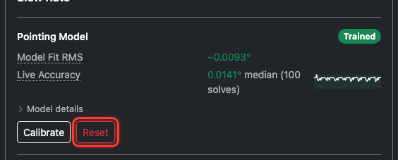

## Find some stars

Point the scope at a patch of sky with visible stars. You don't need to know exactly where you are — the mount doesn't yet. Use the **Jog Pad** on the Telescope card (N/S/E/W directional buttons, press and hold) to slew.

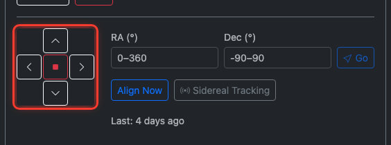

On the Optics card, press **Snap** with a short exposure (say, 2 seconds) to check what the camera sees.

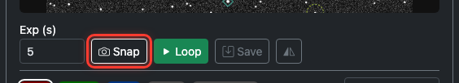

Iterate: jog, Snap, jog, Snap. Once you have stars in the frame — any stars — you're ready to align.

{: .note }
> No frame coming back? Check the Camera badge in the status bar. If the temperature is off or the sensor isn't connected, Snap just hangs. The log panel at the bottom will show you why.

## Align

With stars in the frame, press **Align Now** on the Telescope card. CitraSense takes one frame, plate-solves it against the whole-sky catalog, and syncs the mount to the solved position.

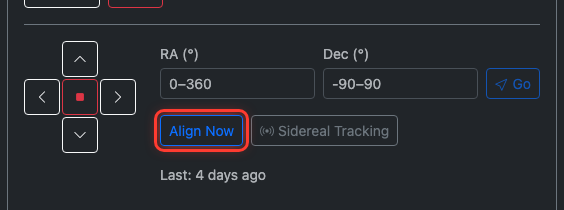

That's it — the mount now knows where it's pointing. From here, **Go To** actually lands on targets.

## Focus

Time to sharpen up. On the Optics card, the **Autofocus** section has a big button that kicks off the routine.

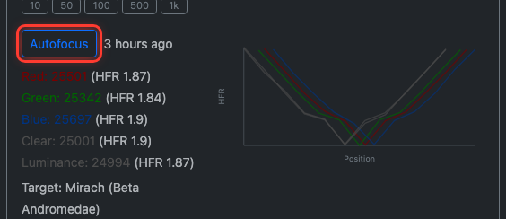

CitraSense's autofocus target is configured in Configuration → **Autofocus** as a preset star (e.g., Mirach, Vega) or custom coordinates. Leave the default. The routine will:

1. Slew to the autofocus target (Go To works now because you aligned).
2. For each enabled filter: step the focuser through a coarse sweep, compute HFR at each stop, fit a hyperbola to the curve, and land on the minimum.
3. Record each filter's best focus position so it can be reapplied mid-task.

Watch the Optics card while it runs:

- A **V-curve chart** builds up live, with one curve per filter color.
- **Per-filter results** list the best position and HFR for each.
- At the end, the **Focus HFR Health** readout shows the baseline HFR — that's your reference point for the rest of the night.

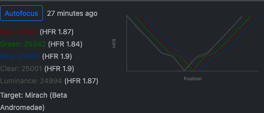

A full five-filter sweep takes about a minute. If you want to refocus a single filter only (say, you bumped the focuser), use the manual step controls under **Focus** to tweak by hand.

## Build the pointing model (optional)

One Align Now sync is enough to get started, but a full pointing model is better — it corrects systematic errors (leveling errors, cone error, tube flex) across the whole sky, not just near the patch you aligned on. You have two ways to get there:

**Run Calibrate now.** On the Telescope card, press **Calibrate**. The routine slews to a sequence of points across the sky, takes a frame at each, plate-solves it, and compares the solved center to the commanded center. Residuals get fit into a model. A progress bar tracks the run. When it finishes, the Pointing Model badge flips to **Trained** and the **Model Fit RMS** and **Live Accuracy** readouts update with the new numbers. Expand **Model details** to see the per-term breakdown (leveling errors, cone angle, non-perpendicularity).

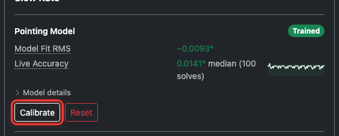

**Let it build itself.** Skip the up-front calibration and start observing. Every real task's pointing-convergence loop contributes a plate-solved data point to the model. The **Live Accuracy** sparkline on the Telescope card shows it improving as the night goes on. This is the lazy path — the first few tasks will converge in more iterations than later ones, but you're imaging sooner.

{: .note }
> Which to pick? If you've got time before your first pass and want tight pointing from task one, run Calibrate. If a pass is starting in two minutes, skip it and let the model self-train.

---

# Part 2 — Run the session

From here, everything is the same on every adapter. You've got a telescope that's aligned and focused, and CitraSense is connected to the Citra Space API. It's time to pull some tasks.

## Pull a task and watch it run

Flip the **Scheduling** switch on at the top of the Monitoring tab. Leave **Robotic** and **Self-Tasking** off for now — we want to drive this manually.

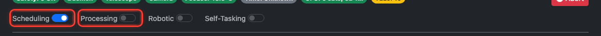

On the **Scheduled Tasks** card, press **Request Batch**. This asks the Citra Space server for a fresh set of satellite passes assigned to your telescope.

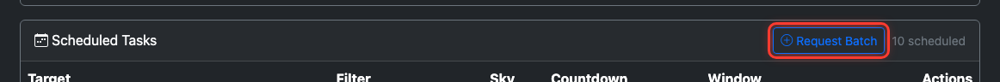

A table fills in:

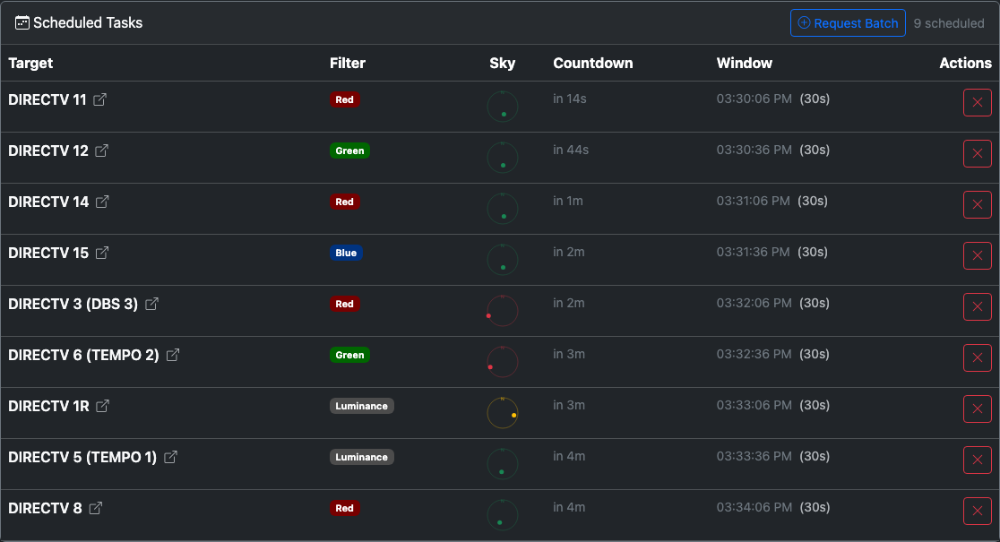

| Column | What you're looking at |
|--------|-----------------------|
| **Target** | Satellite name |
| **Filter** | Which filter the pass was assigned |
| **Sky** | A mini sky compass showing where the target sits right now. Green = well above minimum elevation, yellow = close to the limit, red = below |
| **Countdown** | Time until the observation window opens |
| **Window** | Start–end time range |
| **Actions** | Cancel (×) — removes the task from the server and your queue |

Pick the first task with a short countdown. When the window opens, CitraSense automatically picks it up.

Flip the **Processing** switch on. This is what tells the daemon it's allowed to start executing tasks. Now watch the **Active Tasks** card below Scheduled Tasks. Your task moves through three stages from left to right:

### Imaging stage

CitraSense slews to the predicted RA/Dec, rotates the filter wheel to the assigned filter, applies that filter's focus offset, and runs the exposure. The preview updates with the final image.

### Processing stage

The task hops into the Processing column. Six processors run in order:

1. **Calibration** — applies bias/dark/flat masters if available.
2. **Plate Solver** — astrometry.net computes a WCS solution. Without this, nothing else is possible.
3. **Source Extractor** — SExtractor detects every bright pixel cluster.
4. **Photometry** — cross-matches stars against the APASS catalog, computes a zero-point.
5. **Satellite Matcher** — propagates TLEs to the exposure midpoint and matches predicted positions to detected sources.
6. **Annotated Image** — generates a JPEG overlay with stars, matched satellites, and the target highlighted.

The per-processor progress bar shows success/failure rates as the session grows.

### Submission stage

The result goes up to the Citra Space API. You'll see a green tick for observation uploads, yellow for image-only, red for failures.

---

# Part 3 — Review and next steps

## Review the task

Once the first task finishes, switch to the **Analysis** tab. Your completed task is at the top of the task list.

Click the row to expand the detail panel:

- **Annotated image** on the left — click to open fullscreen. Stars and satellites are overlaid; the target is highlighted.
- **Reprocess panel** lets you re-run the pipeline against the same frame with different SExtractor settings (detection threshold, minimum area, convolution kernel). Great for tuning.
- **Window bar** on the right — shows how the observation window was spent (delay → slew → imaging → margin).
- **Convergence**, **Pointing**, **Imaging**, **Plate solve**, **Photometry**, **Satellite matching** — full diagnostics from every processor.
- **Upload** — whether the result made it to Citra Space, and why not if it didn't.

If the task didn't find its target, the annotated image tells you why: the satellite may have been outside the predicted position (TLE drift), blocked by a cloud, or landed off the sensor (pointing issue). The detail panel has the data to diagnose it.

## Keep driving, or hand off

At this point you have two choices.

**Stay hands-on.** Press **Request Batch** again when your queue runs low, re-run autofocus when HFR drifts off baseline, and cancel any task that looks troubled (weather, elevation, whatever). You're doing the scheduling, CitraSense is doing the imaging and processing.

**Hand off.** When you're confident things are running cleanly, flip **Robotic** (handles unpark at dusk, park at dawn, scheduled autofocus) and optionally **Self-Tasking** (auto-requests new task batches when the queue runs low). Both are documented in the [Monitoring reference](Monitoring#robotic-session). That's the "walk-away" mode — worth a separate session to set up properly.

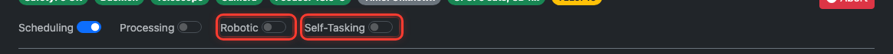

For tonight, staying hands-on is the right call. You'll learn what every number on the dashboard means, and you'll recognize the weird cases when they come up.

## Things to check between sessions

- **Dark, flat, bias masters** — refresh monthly or when conditions change. On Direct Hardware, capture through Configuration → Calibration (see [Capture calibration frames](#calibration-frames) in Part 1 — flats need dusk or dawn). On N.I.N.A., KStars, and INDI, use your adapter's native calibration tools — CitraSense applies whatever masters it finds at processing time.
- **Pointing model** (Direct Hardware) — rebuild after re-leveling the mount, a teardown, or a large temperature shift. Other adapters rely on the mount's own alignment scheme instead.
- **Disk space** — raw FITS and processing artifacts add up fast. **Keep Images** and **Keep Processing Output** settings control retention (Configuration → Processing and Advanced).
- **Log files** — CitraSense rotates daily logs at `~/Library/Logs/citrasense/` (macOS). Paths and copy buttons are on Configuration → **Advanced** → **Paths & Files**.

---

## Learn more

- [Getting Started](GettingStarted.html) — install and launch CitraSense
- [Raspberry Pi image](RaspberryPi) — headless field deployment
- [Configuration reference](Configuration) — every setting explained
- [Monitoring reference](Monitoring) — the live dashboard in detail
- [Analysis reference](Analysis) — post-session review tools
