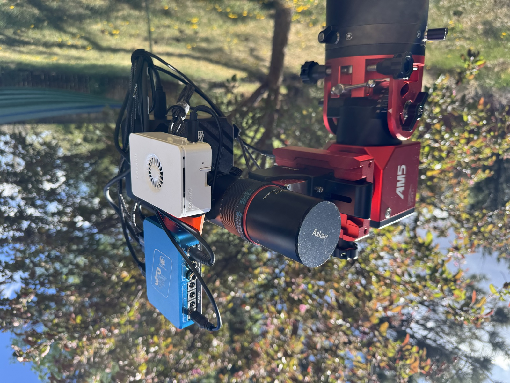

# Raspberry Pi
{: .no_toc }

[citrasense-pi](https://github.com/citra-space/citrasense-pi) is a turnkey SD card image that transforms a Raspberry Pi into a dedicated telescope node. Flash it, power on, connect to WiFi from your phone, and the dashboard is live — no SSH, no terminal, no manual setup.



## What's on the image

| Component | Details |
|-----------|---------|
| **OS** | Raspberry Pi OS Lite ARM64 (Debian Trixie) |
| **CitraSense** | Auto-starts on boot, dashboard on port 80 |
| **INDI** | Pre-installed drivers — CitraSense starts them as needed |
| **GPS timing** | Automatic detection; UART + PPS for Stratum 1 accuracy, USB GPS for position |
| **WiFi** | Captive portal for network setup, automatic hotspot fallback |
| **SSH** | Enabled on port 22 |
| **User** | `citra` / `citra` (sudo enabled) |

**Supported models:** Raspberry Pi 4 (2 GB+) and Raspberry Pi 5.

## Flash the SD card

1. Download the latest `.img.xz` from [citrasense-pi releases](https://github.com/citra-space/citrasense-pi/releases)
2. Flash with [Raspberry Pi Imager](https://www.raspberrypi.com/software/) or [Balena Etcher](https://etcher.balena.io/)
3. Insert the card and power on

## First boot

### Your device gets a mission name

On first boot, the Pi picks a random name from famous space missions:

> voyager, hubble, galileo, juno, kepler, pioneer, viking, luna, apollo, gemini, mercury, atlas, titan, orion, phoenix, spirit, curiosity

This name is permanent. It becomes the WiFi hotspot SSID, the network hostname, and how you find the device on your network. If yours draws `voyager`, everything is `citrasense-voyager` from here on out.

### Connect to WiFi

If the Pi has no Ethernet connection, it creates a hotspot:

1. On your phone or laptop, look for `citrasense-{name}` in the WiFi list
2. Connect with password: **`citra`**
3. A captive portal appears — pick your WiFi network and enter its password
4. The Pi joins your network and the hotspot disappears

{: .note }
If your WiFi goes away — field use, power outage, router reboot — the Pi automatically brings the hotspot back so you can always reconnect.

### Open the dashboard

Once you're on the same network:

```
http://citrasense-{name}.local
```

For example, `http://citrasense-voyager.local`. The dashboard runs on port 80, so no port number is needed. From here the experience is identical to a desktop CitraSense install — connect to the Citra Space API, select your hardware, and you're imaging.

### SSH access

```bash
ssh citra@citrasense-{name}.local
```

Default password is `citra`. The login banner shows your device name and dashboard URL as a reminder.

## GPS (optional)

The image comes pre-configured for GPS. Plug in a receiver and it works automatically.

| GPS type | Position | Timing |
|----------|----------|--------|
| **USB GPS** | Yes | Internet NTP only (no improvement) |
| **UART GPS** (no PPS) | Yes | Coarse — NMEA timestamps via gpsd |
| **UART GPS + PPS** on GPIO 18 | Yes | Stratum 1, microsecond accuracy via chrony |

For best results in the field (no internet), use a UART GPS with PPS. The image configures gpsd, chrony, and the PPS overlay automatically — just wire PPS to GPIO 18.

**Check GPS:** `cgps -s` | **Check time:** `chronyc sources -v`

## Image versioning

Release filenames use dual versioning so you know exactly what's on the card:

```
citrasense-pi-v0.4-cs1.3.0.img.xz
              ────  ───────
              │     └─ CitraSense version (telescope control software)
              └─ Pi image version (OS config, drivers, WiFi, GPS setup)
```

The build always installs the latest CitraSense release available at build time.

## Troubleshooting

**Can't reach `citrasense-{name}.local`:**
- Make sure your device supports mDNS (most do; older Windows may need [Bonjour](https://support.apple.com/kb/DL999))
- Try the Pi's IP address directly — check your router's client list
- If you've forgotten the name, look at your WiFi list for the hotspot SSID

**WiFi hotspot not appearing:**
- Wait 1–2 minutes after power-on
- Make sure WiFi isn't disabled on the Pi (shouldn't be, but verify with Ethernet + SSH if needed)
- Try power cycling

**Forgot the device name:**
- The hotspot SSID shows the name — check your WiFi list
- Or connect via Ethernet and run `hostname`
