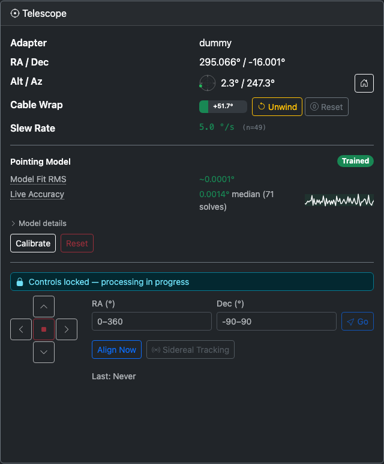
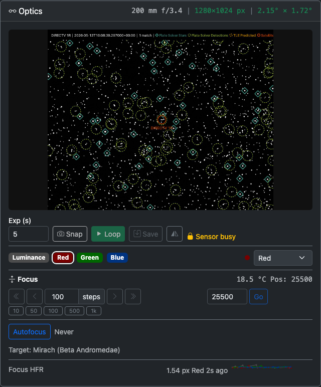
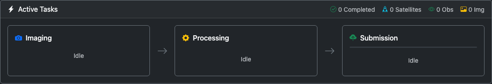
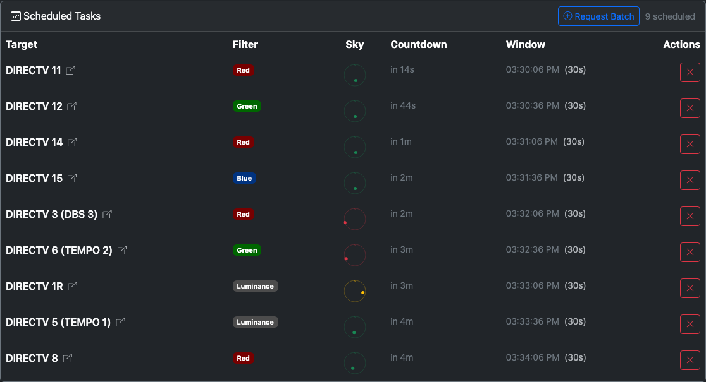

# Telescope Sensor Detail
{: .no_toc }

The telescope sensor detail page is where every mount, optics, autofocus, and per-task control lives. Open it from the [Monitoring](Monitoring.html) tab by clicking a telescope sensor's card header or its **Open** button. The page URL is `/sensors/<sensor-id>`.

The page is laid out top-to-bottom:

1. [Header](#header) — sensor name, hardware pills, operational switches, init status, Reconnect.
2. [Robotic Session](#robotic-session) — nightly dusk-to-dawn lifecycle (only when Robotic is on).
3. [Telescope card](#telescope-card) — adapter, pointing readouts, cable wrap, pointing model, mount controls.
4. [Optics card](#optics-card) — config health, preview, camera controls, filters, focus, autofocus, HFR health.
5. [Active Tasks](#active-tasks) — Imaging → Processing → Submission pipeline.
6. [Scheduled Tasks](#scheduled-tasks) — assigned tasks for this telescope.

---

## Header

The page header shows the sensor name, its modality icon, hardware connection pills (mount / camera / focuser / filter wheel), per-telescope operational switches, the init-state badge if the sensor is not fully connected, and a Reconnect button.

### Operational switches

| Switch | What it controls |
|--------|-----------------|
| **Scheduling** | Citra Space assigns observation tasks to this telescope while on. Turn off to stop receiving new tasks for this scope. |
| **Processing** | Daemon executes queued tasks (imaging, processing, uploading). Turn off to pause execution while keeping the API connection alive. |
| **Robotic** | Enables the robotic observing session: unpark at dusk, run start-of-night autofocus, park at dawn. |

A **Cable Wrap** pill appears next to the switches when the mount has reached its cable-wrap warning or emergency limit.

### Init status badge and Reconnect

When the sensor is fully connected, the init badge is hidden. While the daemon is bringing the adapter up — or after a failure — one of these badges appears:

| Badge | Meaning |
|-------|---------|
| **Pending** (gray) | Adapter has not started connecting yet. |
| **Connecting…** (blue, spinning) | Adapter is establishing a connection right now. |
| **Connect failed** (red) | Last connection attempt raised an error. Hover for the message. |
| **Connect timed out** (red) | Last attempt did not finish before the deadline. |

The **Reconnect** button bounces the adapter — it disconnects and re-establishes hardware. Use it when a connection looks healthy from the outside but has flaked. Disabled while a connect is already in flight.

---

## Robotic Session

The Robotic Session card appears when the **Robotic** switch is on. It tracks the nightly observing lifecycle and shows what the session is doing right now.

| State | Badge | What's happening |
|-------|-------|------------------|
| **Daytime** | Gray | Telescope is parked. Countdown shows time to the next dark window. |
| **Starting Up** | Blue | Sun dropped below the twilight threshold. CitraSense is unparking, running pointing calibration / autofocus, and otherwise preparing. |
| **Observing** | Green | Tasks are being executed. Countdown shows time remaining in the dark window. |
| **Shutting Down** | Yellow | Dawn approaches. CitraSense finishes the current task, parks the mount, and shuts down for the day. |

The card surfaces the **Sun** altitude, the **Threshold** (Civil / Nautical / Astronomical), the **Dark Window** start–end times with total duration, and an **Activity** line during startup and shutdown (e.g., "Unparking mount", "Running autofocus"). A spinner runs during startup and shutdown.

---

## Telescope Card

The Telescope card shows the mount's current state and exposes direct mount controls for adapters that support them.

### Status fields

| Field | Description |
|-------|-------------|
| **Adapter** | The active hardware adapter for this sensor (Direct, N.I.N.A., KStars, INDI). |
| **RA / Dec** | Current telescope pointing in degrees. |
| **Alt / Az** | Current altitude and azimuth in degrees, with a polar diagram. The dot shows where the telescope is pointing — center is zenith, edge is horizon, North at top. A **Home** button (house icon) on this row sends the mount to its home position. |

### Cable Wrap

If the mount tracks cable rotation, a progress bar shows the cumulative cable wrap in degrees. The bar fills toward the soft limit (where new tasks are paused) and the hard limit (where motion is aborted).

- **Unwind** — Reverses the mount rotation to unwind cables. Appears when wrap exceeds 5°.
- **Reset** — Zeros the counter after you manually straighten cables.

When an unwind is in progress, the bar animates with a striped fill.

### Altitude Limits

When the mount reports altitude limits, they appear as the minimum (horizon) and maximum (overhead) degrees the mount will accept.

### Config Health

Telescope-related configuration checks appear here. Each check compares a value you have configured against what the hardware actually reports. When they differ significantly, a yellow warning shows the discrepancy as `configured → observed (+N%)`.

Currently tracked:

| Check | What it compares |
|-------|-----------------|
| **Slew Rate** | Configured maximum slew rate vs. the rolling mean of observed slew times. Shows the sample count `(n=N)` used to compute the average; warnings appear only once enough samples have been collected. |

More checks will appear as the adapter collects data during a session.

### Pointing Model

For Direct Hardware adapters, the Pointing Model section shows the live state of the multi-point pointing model:

| Element | Description |
|---------|-------------|
| **State badge** | Untrained / Partial / Trained / Degraded. |
| **Model Fit RMS** | The average residual error of the pointing model in degrees, color-coded green/yellow/red against your field of view. |
| **Live Accuracy** | Median pointing error measured from recent plate solves, with a count of contributing solves and a sparkline chart of the trend. The chart's green/yellow/red bands match the same FOV-relative thresholds. |
| **Model details** (expandable) | Leveling errors (N-S and E-W), model terms (IE, CA, NPAE depending on fit), and calibration point count. |

If the live accuracy drifts above the FOV-relative threshold, the badge flips to **Degraded** and a "Recalibration recommended" alert appears.

Controls:

- **Calibrate** — Runs an automated multi-point calibration sequence across the sky. During calibration, a progress bar shows the current step (e.g., "5 / 25") with a **Cancel** button.
- **Reset** — Clears all calibration data (requires confirmation). Disabled while imaging is active.

### Mount Controls (Direct Hardware adapters)

Additional mount controls appear at the bottom of the Telescope card for adapters that support direct control:

- **Jog pad** — 3×3 grid of N/S/E/W buttons for manual mount movement. Press and hold to move; release to stop. Center button stops all axes immediately. Works with both mouse and touch.
- **Go To** — Enter target RA (0–360°) and Dec (−90–90°), press **Go** to slew. The button is disabled while the mount is slewing or busy.
- **Align Now** — Triggers a plate-solve alignment to sync the mount model. The button changes to **Cancel Alignment** while running and shows progress text and a spinner; below it the last alignment timestamp is displayed when idle.
- **Sidereal Tracking** — Toggle the mount's sidereal tracking on or off.
- **Slewing** pill — Animated badge that appears whenever the mount is in motion.

{: .note }
> When the system is busy (imaging, autofocus, alignment), all mount controls lock and an info banner explains why: "Controls locked — Imaging in progress" or similar.

---

## Optics Card

The Optics card covers the camera, filter wheel, focuser, autofocus, and focus health — everything on the optical path.

### Config Health

A compact strip in the card header shows key optical parameters: focal length, sensor resolution, and field of view. Values are colored:

- **Green** — matches the hardware (or the server config it was checked against).
- **Yellow** — differs from configuration; the observed value appears next to the configured one with the percent difference.
- **Muted** — pending an observation to verify.

A warning banner appears in the card body listing any failing checks, including pixel scale and sensor resolution mismatches that aren't shown in the header strip.

### Preview Image

The preview area shows the most recent image captured by this telescope's camera. Click it to open a fullscreen lightbox.

### Camera Controls (Direct Hardware adapters)

| Control | Action |
|---------|--------|
| **Exp (s)** | Preview exposure time in seconds (0.01–30, decimal values allowed). |
| **Snap** | Take a single preview exposure. |
| **Loop** | Start continuous preview exposures (button turns red; click again to stop). |
| **Save** | Capture a full FITS image at the current exposure. |
| **Flip** | Horizontally flip the preview — useful when a diagonal mirror inverts the image. |

A **Sensor busy** indicator appears in place of these controls when an imaging task is in progress.

### Filter Wheel

When filters are configured, a row of color-coded badges shows every enabled filter. The current filter has a white outline. For Direct Hardware adapters, a dropdown next to the badges lets you change the filter manually.

### Focus Controls

The Focus section appears when a focuser is connected. The header shows the current position and temperature (when reported).

| Control | Action |
|---------|--------|
| **Coarse in/out** (double chevron) | Move the focuser by 10× the step size. |
| **Fine in/out** (single chevron) | Move by 1× the step size. |
| **Step size** | Number input plus quick-select buttons: **10**, **50**, **100**, **500**, **1k**. |
| **Absolute Go-To** | Enter a target position and press **Go**. |
| **Stop** (red) | Abort an in-progress move (appears only while the focuser is moving). |

A "Moving…" indicator with a spinner shows while the focuser is in transit.

### Autofocus

When the adapter supports autofocus, the Autofocus section exposes:

- **Autofocus button** — Triggers a manual run. Changes to **Cancel AF** while running.
- **Last autofocus** — Timestamp of the last successful run.
- **Per-filter results** — After a multi-filter run, each filter's best position and HFR are listed in the filter's color.
- **V-curve chart** — Plots HFR (Half-Flux Radius) vs. focuser position for each filter, showing the characteristic V-shape autofocus uses to find best focus. Each filter is a separate colored polyline.
- **Target** — The target the autofocus routine will slew to (configured in the [Autofocus config tab](Configuration.html#autofocus) as a preset star or custom coordinates).
- **Next in** — Countdown to the next scheduled autofocus, when autofocus scheduling is enabled.

When a run completes or fails, a toast notification appears with the result (succeeded with best position, or failed with the reason).

### Focus HFR Health

The Focus HFR readout tracks focus quality over time:

| Element | Description |
|---------|-------------|
| **Focus HFR** | Median half-flux radius from the most recent measurement in pixels, plus the filter and "Xs ago" age. Color-coded green/yellow/red against the autofocus baseline. |
| **Sparkline** | Mini chart of HFR trend over recent observations, with one polyline per filter. Green/yellow/red bands match the refocus-threshold zones. |
| **Baseline** | The HFR established during the last autofocus run, used as the reference. |
| **Refocus threshold** | When auto-refocus is enabled, shows the percentage increase that will trigger an automatic refocus. |

If neither a baseline nor a recent reading is available, the panel prompts "Run autofocus to calibrate".

---

## Active Tasks

The Active Tasks pipeline shows real-time progress for this telescope's task flow. Tasks move left to right through up to three stages.

### Pipeline header

The card header shows cumulative session counts for this telescope:

- **Completed** — total tasks that have finished all stages successfully
- **Satellites** — number of satellite identifications made by the satellite matcher
- **Obs** — observation data uploads to the Citra Space API
- **Img** — image file uploads

### Pipeline stages

| Stage | Icon | What happens |
|-------|------|-------------|
| **Imaging** | Camera | The telescope slews to the target, configures the camera, and captures exposures. Each task shows the target name, elapsed time, and a status message (e.g., "Exposing frame 3 of 5"). |
| **Processing** | Gear | Captured images pass through the processing pipeline: calibration, plate solving, source extraction, photometry, satellite matching. A per-stage success/failure progress bar shows the ratio. Only visible when processors are enabled. |
| **Submission** | Cloud | Processed results are uploaded to the Citra Space API. A three-color bar shows observation uploads (green), image-only uploads (yellow), and failures (red). |

Each stage box shows a count badge for tasks currently in that stage, a progress bar, and the list of tasks with their elapsed time and status. On error, the status line includes a retry countdown (e.g., "Upload failed, retrying in 45s...").

---

## Scheduled Tasks

The Scheduled Tasks card lists every observation task the Citra Space scheduler has assigned to this telescope.

| Column | Description |
|--------|-------------|
| **Target** | The satellite or target name. When the Citra app URL is configured and the task carries a satellite ID, the name links to the satellite page on citra.space (opens in a new tab). |
| **Filter** | The assigned filter, shown as a color-coded badge. |
| **Sky** | A miniature polar compass showing where the target sits in the sky. Center is zenith, edge is horizon, North at top. Dot color: **green** above the minimum elevation, **yellow** within 10° of the limit, **red** below it. A dashed ring marks your configured minimum elevation. Hover for exact altitude, azimuth, trend, peak altitude, and estimated slew time. |
| **Countdown** | Time until the observation window opens — or closes, if the task is active. |
| **Window** | The start time plus window duration (hidden on small screens). An **overlap** badge appears when this window opens before the previous task's window closes. |
| **Actions** | A **Cancel** button (×) cancels the task on the Citra Space server. Hidden for the active task. |

Active tasks are highlighted. Completed and cancelled tasks are removed on the next poll cycle.
