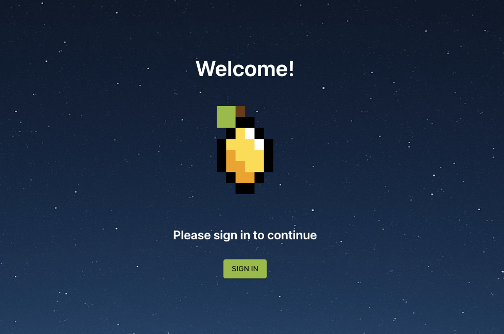
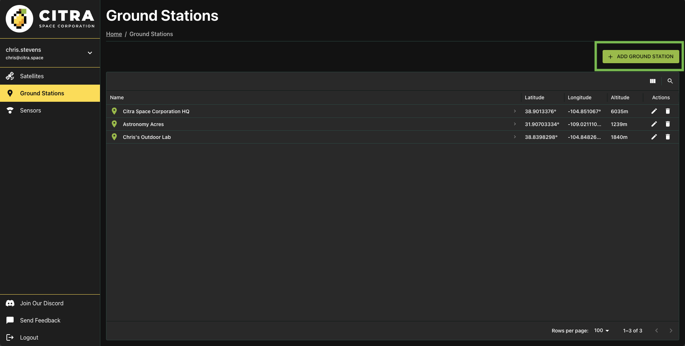
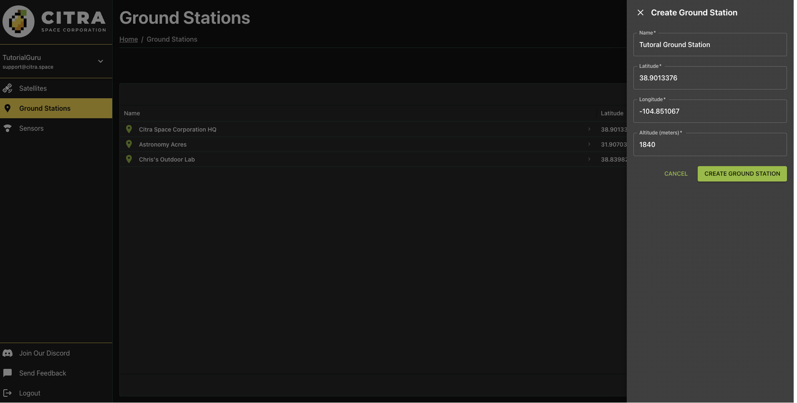
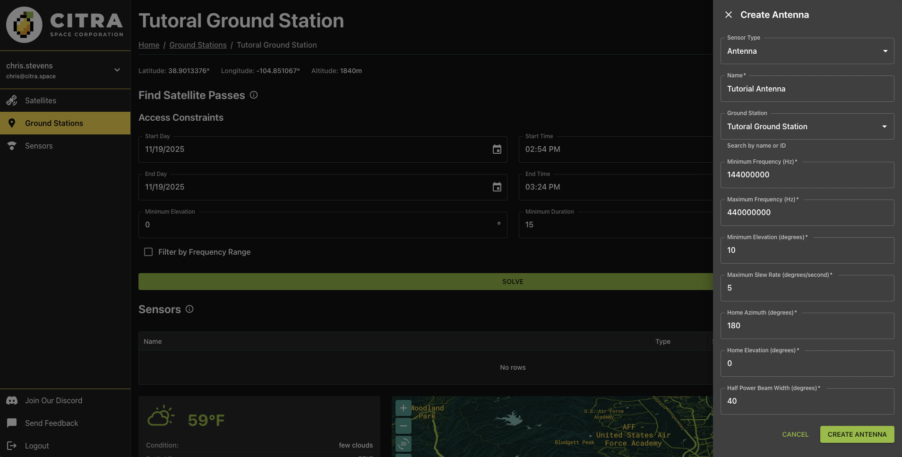
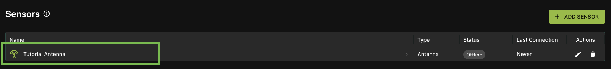
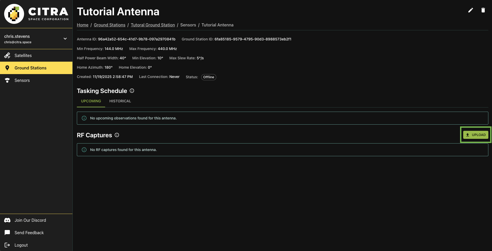

# Add and Manage Antennas

Welcome to Citra Space! This guide will walk you through the process of adding and managing antennas for tasking within the Citra platform. Whether you're a new user or looking to expand your existing setup, this tutorial will provide step-by-step instructions to help you get started.

## Prerequisites

RF equipment is required for accepting tasking requests. However, you can still create an account and add offline antennas to explore the platform's features.

## Create a Citra Space Account

Visit the Citra Space app at [https://app.citra.space](https://app.citra.space) and choose `SIGN IN`, then choose `Create an account` in the Sign in form and follow the prompts. For full sign up instructions, see the [Sign Up guide](../sign-up.md).

## Add a Ground Station

The ground station represents the physical location where your antenna(s) and other equipment are installed. It serves as the hub for managing your observation devices and coordinating tasking requests within the Citra platform. It also opens up additional features such as weather monitoring and a satellite access window calculator that can identify targets for a telescope.

{: .note }
> Antennas can also be added without a ground station on the [Sensors page](https://app.citra.space/sensors) to be assigned later. However, antennas and other sensors cannot be tasked without a ground station.

Visit the [Ground Stations page](https://app.citra.space/ground-stations) and choose `ADD GROUND STATION`.

Complete the required fields in the `Create Ground Station` form then choose `CREATE GROUND STATION`. The location will be used for weather monitoring, satellite access window calculations and as a location coordinate reference for images uploaded for an antenna.

Completing the form will redirect to the new ground station page.

Choose the `ADD SENSOR` button to add an antenna to the ground station.

In the Create Antenna form, the `Sensor Type` of `Antenna` is pre-selected. It's also possible to add telescopes (see [Add and Manage Telescopes](./add-and-manage-telescopes.md)). Leave the default selection.

### Name

Give the antenna a descriptive name in the `Name` field. This helps identify the antenna when managing multiple sensors or reviewing tasking assignments.

### Ground Station

The current ground station will be pre-selected in the `Ground Station` field. Leave as-is unless you want to assign this antenna to a different ground station.

### Minimum Frequency (Hz)

The lowest frequency the antenna can receive or transmit, measured in Hertz. This defines the lower bound of the antenna's operational frequency range. For example, an antenna operating in the UHF band might have a minimum frequency of `400000000` Hz (400 MHz).

### Maximum Frequency (Hz)

The highest frequency the antenna can receive or transmit, measured in Hertz. Together with the minimum frequency, this defines the antenna's total operational bandwidth. For example, an antenna covering VHF to UHF might have a maximum frequency of `450000000` Hz (450 MHz).

### Minimum Elevation (degrees)

The lowest angle above the horizon that the antenna can safely point, measured in degrees. This accounts for physical obstructions like buildings or trees, as well as increased noise and signal degradation at low elevation angles. Typical values range from `5` to `15` degrees.

### Maximum Slew Rate (degrees/second)

The fastest speed at which the antenna mount can rotate to track satellites, measured in degrees per second. This affects how quickly the antenna can acquire and follow fast-moving targets like LEO satellites. Higher slew rates enable tracking of satellites with faster apparent motion across the sky.

### Home Azimuth (degrees)

The default horizontal angle position (compass direction) where the antenna rests when not in use, measured in degrees. Azimuth is measured clockwise from north (0°/360° = North, 90° = East, 180° = South, 270° = West). This represents the antenna's parking position.

### Home Elevation (degrees)

The default vertical angle position where the antenna rests when not in use, measured in degrees above the horizon. This represents the antenna's parking position. A value of `0` means horizontal, while `90` means pointing straight up at zenith.

### Half Power Beam Width (degrees)

The angular width of the antenna's main radiation lobe, measured in degrees between the points where the signal power drops to half (-3 dB) of the peak value. A narrower beam width indicates a more directional antenna with higher gain, while a wider beam width provides broader sky coverage but lower gain. This value affects tracking precision requirements and signal strength.

Choose `CREATE Antenna` to add the antenna.

The new antenna will be listed in the `Sensors` section of the ground station page. Click on the antenna name to view details and antenna features.

## Tasking Schedule

The antenna page features a Tasking Schedule section that displays upcoming tasking requests assigned to the antenna. This is part of an upcoming feature and will be expanded in future releases.

## RF Captures

View and upload RF capture data collected by this antenna for processing and analysis. Choose the `UPLOAD` button and select a json file in the format described [here](https://api.citra.space/docs#/rf_captures/create_rf_capture_rf_captures_post).

{: .note }
> The API can also be used to upload RF captures programmatically. See the [API Documentation](https://api.citra.space/docs#/rf_captures) for more information.

## Next Steps

Visit the antenna's ground station page for weather and visibility forecasts. Calculate what satellites will be flying over the antenna's location over a given time range. Join our [Discord community](https://discord.gg/STgJQkWe9y) to offer feedback

More features are coming soon.

## Support

Have questions or need assistance? Join our [Discord community](https://discord.gg/STgJQkWe9y) to get support from multiple folks in the space. You can also select `Send Feedback` in the left navigation menu from within the app.
