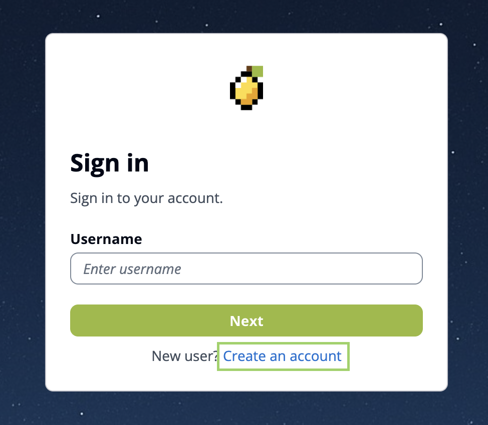
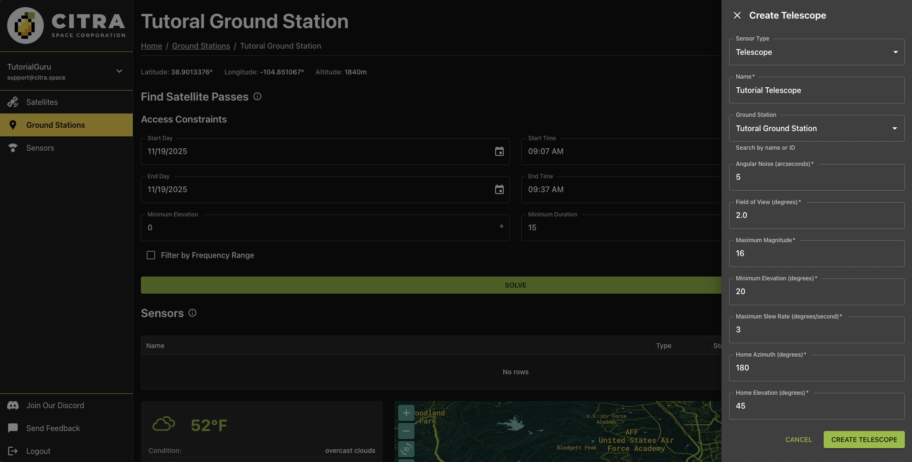
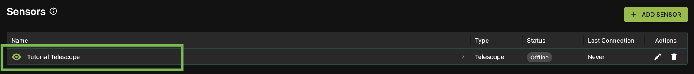
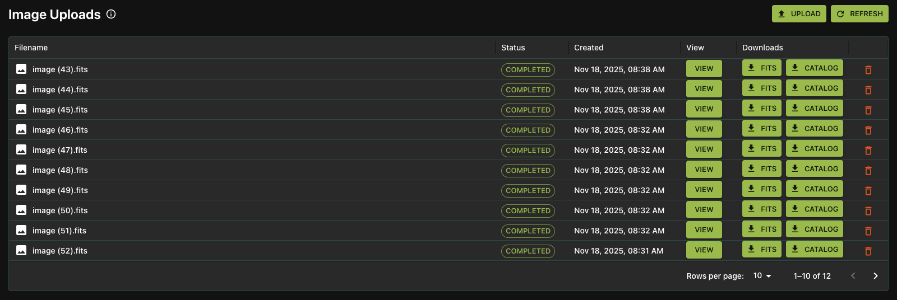

# Add and Manage Telescopes

Welcome to Citra Space! This guide will walk you through the process of adding and managing telescopes for tasking within the Citra platform. Whether you're a new user or looking to expand your existing setup, this tutorial will provide step-by-step instructions to help you get started.

## Prerequisites

A telescope or camera capable of astrophotography is required for accepting tasking requests. However, you can still create an account and add offline telescopes to explore the platform's features.

## Create a Citra Space Account

Visit the Citra Space app at [https://app.citra.space](https://app.citra.space) and choose `SIGN IN`.

Choose `Create an account` in the Sign in form.

Complete required field in the sign up form then choose `Sign Up`.

An email will be sent to the address provided, containing a verification code. Please check your inbox (and spam folder if necessary) for this email. Enter the verification code in the app to complete account setup.

Login to the new account.

## Add a Ground Station

The ground station represents the physical location where your telescope(s) and other equipment are installed. It serves as the hub for managing your observation devices and coordinating tasking requests within the Citra platform. It also opens up additional features such as weather monitoring and a satellite access window calculator that can identify targets for a telescope.

{: .important }
> Telescopes can also be added without a ground station on the [Sensors page](https://app.citra.space/sensors) to be assigned later. However, telescopes and other sensors cannot be tasked without a ground station.

Visit the [Ground Stations page](https://app.citra.space/ground-stations) and choose `ADD GROUND STATION`.

Complete the required fields in the `Create Ground Station` form then choose `CREATE GROUND STATION`. The location will be used for weather monitoring, satellite access window calculations and as a location coordinate reference for images uploaded for a telescope.

Completing the form will redirect to the new ground station page.

Choose the `ADD SENSOR` button to add a telescope to the ground station.

In the Create Telescope form, the `Sensor Type` of `Telescope` is pre-selected. It's also possible to add antennas (see [Add and Manage Antennas](./add-and-manage-antennas.md)). Leave the default selection.

### Name

Give the telescope a descriptive name in the `Name` field. This helps identify the telescope when managing multiple sensors or reviewing tasking assignments.

### Ground Station

The current ground station will be pre-selected in the `Ground Station` field. Leave as-is unless you want to assign this telescope to a different ground station.

### Angular Noise (arcseconds)

Angular noise represents the pointing accuracy or jitter of your telescope mount, measured in arcseconds. This value indicates the expected deviation in pointing precision due to mechanical limitations, atmospheric effects, or tracking errors. Lower values indicate better pointing accuracy. For stationary camera setups on tripods, enter `0`.

### Field of View (degrees)

The field of view is the observable area your telescope can capture in a single image, measured in degrees. This depends on your telescope's focal length and camera sensor size. A wider field of view allows you to capture larger portions of the sky but with less magnification. To calculate your field of view, you can use online FOV calculators with your telescope and camera specifications.

### Maximum Magnitude

The maximum (faintest) magnitude represents the dimmest object your telescope can detect. In astronomy, larger magnitude numbers indicate fainter objects. This value depends on your telescope's aperture, camera sensitivity, and exposure capabilities. For example, a value of `15` means you can detect objects as faint as magnitude 15.

### Minimum Magnitude

The minimum (brightest) magnitude represents the brightest object your telescope can observe without saturation. Smaller and negative magnitude numbers indicate brighter objects. For example, a value of `-5` means you can observe very bright objects like planets or bright satellites without overexposing your sensor.

### Minimum Elevation (degrees)

The minimum elevation is the lowest angle above the horizon that your telescope can safely point, measured in degrees. This accounts for physical obstructions like buildings, trees, or the mount's mechanical limits. Typical values range from `10` to `30` degrees, though this varies by location and setup.

### Maximum Slew Rate (degrees/second)

The maximum slew rate is the fastest speed at which your telescope mount can move between targets, measured in degrees per second. This affects how quickly you can reposition for new observations. For stationary camera setups on tripods, enter `0` since they cannot automatically slew to new positions.

### Home Azimuth (degrees)

The home azimuth is the default horizontal angle position (compass direction) where your telescope rests when not in use, measured in degrees. Azimuth is measured clockwise from north (0°/360° = North, 90° = East, 180° = South, 270° = West). This represents your telescope's parking position.

### Home Elevation (degrees)

The home elevation is the default vertical angle position where your telescope rests when not in use, measured in degrees above the horizon. This represents your telescope's parking position. A value of `0` means horizontal, while `90` means pointing straight up at zenith.

Choose `CREATE Telescope` to add the telescope.

The new telescope will be listed in the `Sensors` section of the ground station page. Click on the telescope name to view details and telescope features.

## Tasking Schedule

The telescope page features a Tasking Schedule section that displays upcoming tasking requests assigned to the telescope. This is part of an upcoming feature and will be expanded in future releases.

## Image Uploads

The telescope page also includes an Image Uploads section where images captured by the telescope can be uploaded and viewed. It can be used immediately to manually upload images for review.

To upload an image, choose the `UPLOAD` button and choose an image in FITS, jpg, or png format. Note that if GPS coordinates are not included in the FITS header, it will default to the ground station coordinates.

The image will be queued for processing. This will mark stars and satellites detected in the image and generate a preview that can be viewed directly in the app.

Once processed, the image will be listed in the Image Uploads section with a status of `COMPLETED`. Click the VIEW button to see the image preview with processed data overlay that includes stars and detected satellite locations. Choose the FITS and CATALOG buttons to download the processed FITS file and a catalog of detected objects in the image, respectively.

{: .important }
> The API can also be used to upload observation images programmatically. See the [API Documentation](https://api.citra.space/docs#/images) for more information.

