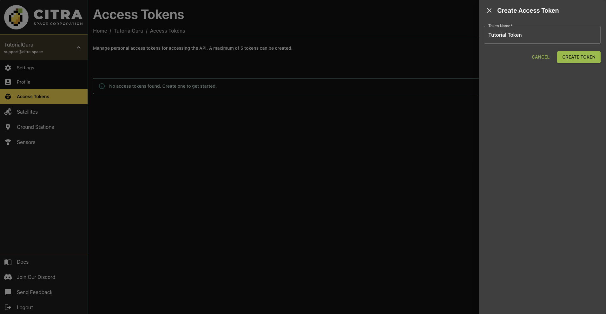
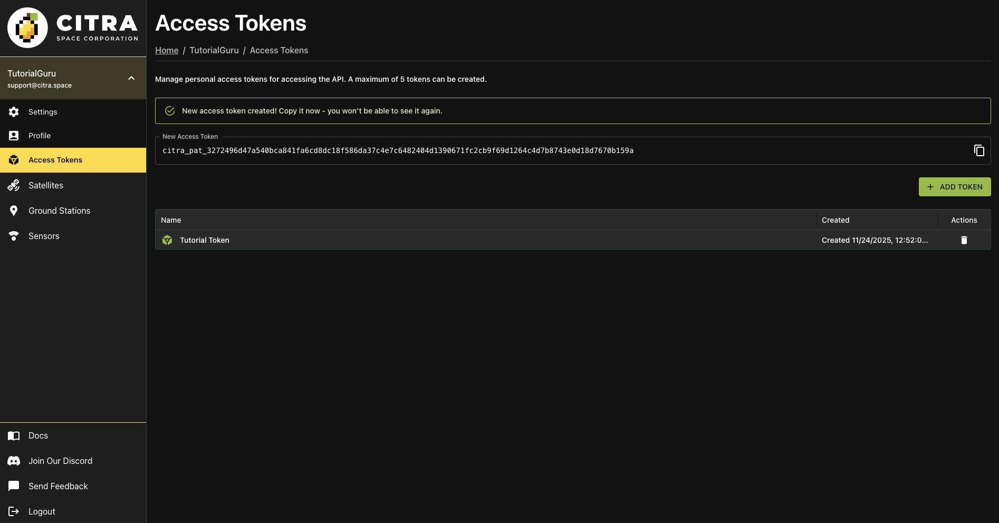

# Access Tokens

Access tokens allow you to authenticate with the [Citra Space API](../api-docs.md) for programmatic access to your account. You can create, view, and manage your personal access tokens from the Citra Space app.

Visit the Citra Space app at [https://app.citra.space](https://app.citra.space) and choose `SIGN IN`, then choose `Create an account` in the Sign in form and follow the prompts. For full sign up instructions, see the [Sign Up guide](../sign-up.md).

Then, Choose your username in the left navigation menu to extend the menu, then choose `Access Tokens`.

Choose `+ ADD TOKEN` to create a new access token.

Give the token a memorable name in the `Token Name` field to help identify it later then choose `CRREATE TOKEN`.

The new access token will be displayed once. Copy the token value and store it securely. You won't be able to view the token again after navigating away from this page. A new token can be created if needed later at anytime.

{: .note }
> Treat your access tokens like passwords. Do not share them or expose them in public repositories. These are system-to-system access keys that provide access to your account.

